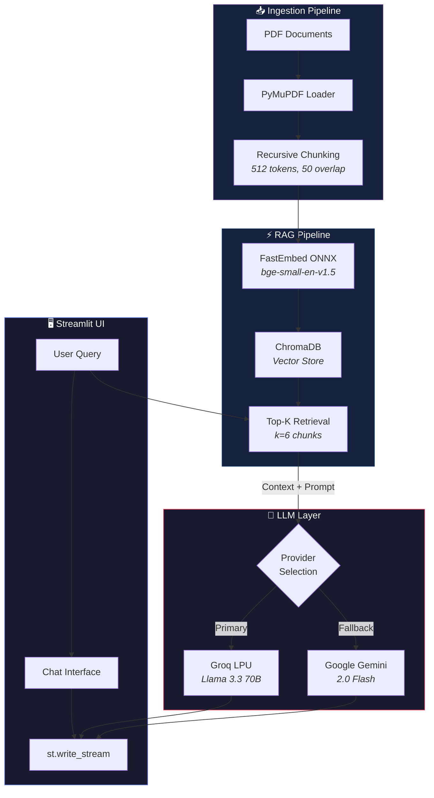
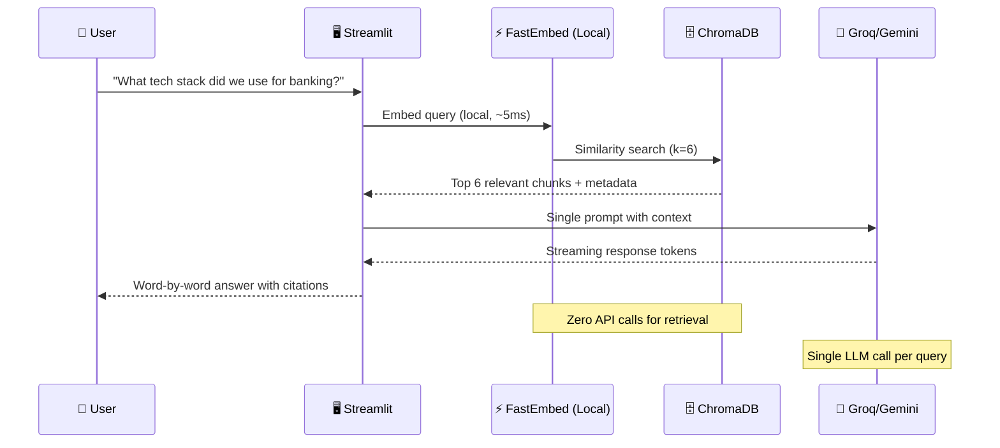
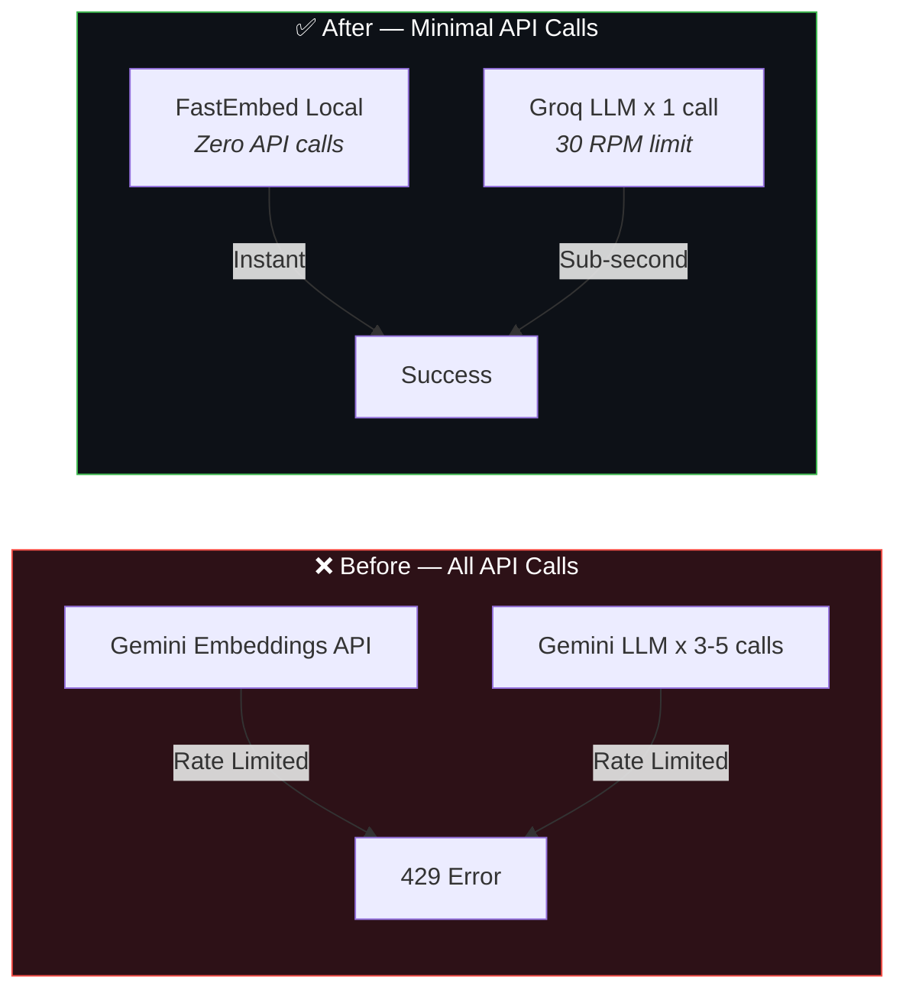

<div align="center">

# 🔍 Internal RFP Analyst

### AI-Powered RAG Knowledge Agent for Enterprise Consulting

[](https://app-rfp-analyst-ne9xjgfqqdmtrrmgns8jfa.streamlit.app/)
[](https://python.org)
[](https://langchain.com)
[](https://groq.com)
[](LICENSE)

**Instantly search past proposals, RFP responses, project outlines, and case studies using natural language.** Built with a production-grade RAG pipeline featuring local ONNX embeddings, streaming LLM responses, and multi-provider failover.

[Live Demo](https://app-rfp-analyst-ne9xjgfqqdmtrrmgns8jfa.streamlit.app/) · [Architecture](#-architecture) · [Quick Start](#-quick-start) · [Challenges & Solutions](#-engineering-challenges--solutions)

</div>

---

## ✨ Key Features

| Feature | Description |
|---|---|
| 🔍 **Semantic Search** | Natural language queries over a ChromaDB vector store with relevance-scored retrieval |
| ⚡ **Streaming Responses** | Word-by-word response streaming via `st.write_stream` for instant perceived performance |
| 🧠 **Local Embeddings** | ONNX-based FastEmbed (`bge-small-en-v1.5`) — zero API calls, zero rate limits for retrieval |
| 🔄 **Multi-Provider LLM** | Groq (Llama 3.3 70B) primary + Gemini fallback — automatic provider selection |
| 📄 **PDF Ingestion** | Upload custom PDFs or use the built-in 10-document consulting knowledge base |
| 📚 **Source Citations** | Every answer cites exact document name and page number |
| 💬 **Conversation Memory** | Chat history maintained in-session for contextual follow-ups |
| ☁️ **Zero-Config Deploy** | Auto-generates sample documents and ingests on first Streamlit Cloud boot |

---

## 🏗️ Architecture



### Request Flow (Single Query)



---

## 🛠️ Technology Stack

| Layer | Technology | Why This Choice |
|---|---|---|
| **LLM (Primary)** | Groq — Llama 3.3 70B | Fastest free inference (LPU), 30 RPM, sub-second latency |
| **LLM (Fallback)** | Google Gemini 2.0 Flash | Free tier backup, 15 RPM |
| **Embeddings** | FastEmbed (ONNX) — `bge-small-en-v1.5` | Local execution, no API calls, no rate limits |
| **Vector Store** | ChromaDB (persistent) | Lightweight, embedded, perfect for document-scale RAG |
| **RAG Framework** | LangChain 0.3+ | Industry-standard abstractions for retrieval chains |
| **PDF Processing** | PyMuPDF | Fastest Python PDF parser, preserves layout metadata |
| **UI** | Streamlit | Rapid prototyping with built-in streaming support |
| **Deployment** | Streamlit Community Cloud | Free hosting with GitHub auto-deploy |

---

## 🚀 Quick Start

### Option 1: Use the Live Demo
👉 **[app-rfp-analyst.streamlit.app](https://app-rfp-analyst-ne9xjgfqqdmtrrmgns8jfa.streamlit.app/)** — No setup required. The app auto-generates sample documents on first load.

### Option 2: Run Locally

#### 1. Get a Free API Key (Choose One)

| Provider | Speed | Free Limit | Get Key |
|---|---|---|---|
| **Groq** ⭐ Recommended | ~100 tok/s | 30 RPM, 6000 RPD | [console.groq.com/keys](https://console.groq.com/keys) |
| Google Gemini | ~30 tok/s | 15 RPM | [aistudio.google.com/apikey](https://aistudio.google.com/apikey) |

#### 2. Setup

```bash
# Clone the repository
git clone https://github.com/tusharg007/Internal-RFP-Analyst.git
cd Internal-RFP-Analyst

# Create virtual environment
python -m venv venv
venv\Scripts\activate          # Windows
# source venv/bin/activate     # Mac/Linux

# Install dependencies
pip install -r requirements.txt

# Configure API key
copy .env.example .env
# Edit .env → add your GROQ_API_KEY (or GOOGLE_API_KEY)
```

#### 3. Launch

```bash
streamlit run app.py
```

The app will auto-generate 10 sample consulting documents and build the vector store on first launch.

---

## 💬 Example Queries

| Query | What It Tests |
|---|---|
| *"List all projects with their timelines"* | Full knowledge base traversal |
| *"What tech stack did we use for the banking audit?"* | Precise document retrieval |
| *"Compare the healthcare and insurance projects"* | Cross-document synthesis |
| *"Which projects used Azure services?"* | Multi-document filtering |
| *"What was the budget for the supply chain platform?"* | Specific fact extraction |
| *"What compliance frameworks did we follow in pharma?"* | Domain-specific retrieval |

---

## 🧪 Engineering Challenges & Solutions

### Challenge 1: Gemini API Rate Limits Killed the App

**Problem:** The original architecture used Google Gemini for *both* embeddings and LLM generation. The free tier (100 embedding req/min, 15 LLM req/min) was exhausted within minutes, returning `429 RESOURCE_EXHAUSTED` errors. The multi-step ReAct agent made 3-5 LLM calls per query, compounding the problem.

**Solution: Hybrid local + cloud architecture**



| Metric | Before | After | Improvement |
|---|---|---|---|
| API calls per query | 4-6 (embed + 3-5 LLM) | **1** (LLM only) | **83% reduction** |
| Embedding rate limits | 100/min (API) | **∞** (local) | **Eliminated** |
| LLM rate limits | 15 RPM (Gemini) | **30 RPM** (Groq) | **2x headroom** |

### Challenge 2: 10+ Minute Response Times

**Problem:** The ReAct agent architecture (LangGraph) made multiple sequential LLM calls — tool selection → execution → result processing → possibly more tools → final answer. Each call could trigger a rate-limit retry with exponential backoff (10s → 20s → 40s), compounding to 10+ minute waits.

**Solution: Single-call RAG with streaming**

- Replaced multi-step ReAct agent with a **single LLM call** architecture
- All context (retrieved chunks + project list + chat history) is assembled locally and sent in one prompt
- **Streaming responses** via `st.write_stream()` — text appears word-by-word, so the user sees output within 500ms even if full generation takes 3-5s

| Metric | Before (ReAct) | After (Single-Call RAG) |
|---|---|---|
| LLM calls per query | 3-5 | **1** |
| Worst-case response time | 10+ minutes | **3-8 seconds** |
| Perceived latency | Full wait → wall of text | **~500ms** (streaming) |

### Challenge 3: Sample Question Buttons Did Nothing

**Problem:** Clicking a sample question button added the message to chat history and triggered `st.rerun()`, but after the rerun, only the `st.chat_input()` code path processed queries — sample button clicks were silently ignored.

**Solution:** Introduced a `pending_query` session state flag. Button clicks set this flag before rerun. After rerun, a dedicated handler detects the pending query and routes it through the same processing pipeline as typed messages.

### Challenge 4: Ephemeral Filesystem on Streamlit Cloud

**Problem:** Streamlit Cloud's filesystem resets on every cold start, losing the vector store and requiring re-ingestion.

**Solution:** Auto-setup pipeline — on first load, the app detects an empty vector store, generates 10 sample PDFs via `document_generator.py`, and ingests them automatically. With local embeddings, this entire process completes in **under 15 seconds** (vs. minutes with API-based embeddings).

---

## 📁 Project Structure

```
Internal-RFP-Analyst/
├── app.py                    # Streamlit UI with streaming chat
├── agent.py                  # RAG query engine (Groq/Gemini + retrieval)
├── rag_engine.py             # Ingestion pipeline (FastEmbed + ChromaDB)
├── config.py                 # Central configuration & provider selection
├── document_generator.py     # Generates 10 realistic consulting PDFs
├── requirements.txt          # Python dependencies
├── .env.example              # API key template
├── .streamlit/
│   └── config.toml           # Streamlit theme configuration
├── data/documents/           # PDF documents (auto-generated)
└── vectorstore/              # ChromaDB persistent storage
```

### Module Responsibilities

| Module | Lines | Responsibility |
|---|---|---|
| `config.py` | ~75 | API keys, model selection, RAG parameters, system prompt |
| `rag_engine.py` | ~165 | PDF loading → chunking → local embedding → ChromaDB storage/retrieval |
| `agent.py` | ~155 | LLM provider selection, prompt assembly, streaming query execution |
| `app.py` | ~280 | Streamlit UI, session management, chat rendering, error handling |
| `document_generator.py` | ~550 | Generates 10 industry-specific consulting PDFs with realistic content |

---

## 🔧 Configuration

### Environment Variables

| Variable | Required | Description |
|---|---|---|
| `GROQ_API_KEY` | ⭐ Recommended | Groq API key for fastest inference ([get free key](https://console.groq.com/keys)) |
| `GOOGLE_API_KEY` | Optional | Google Gemini key as fallback ([get free key](https://aistudio.google.com/apikey)) |

### For Streamlit Cloud Deployment

Add secrets in **Settings → Secrets**:

```toml
GROQ_API_KEY = "gsk_your_key_here"
# Optional fallback:
# GOOGLE_API_KEY = "your_google_key_here"
```

---

## 📜 License

This project is for educational and portfolio demonstration purposes. Built by [Tushar Ghosh](https://github.com/tusharg007).
