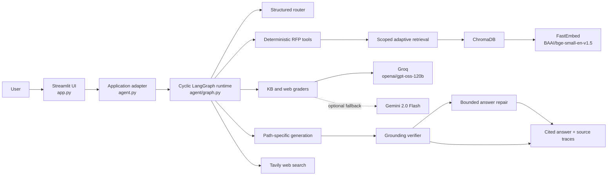
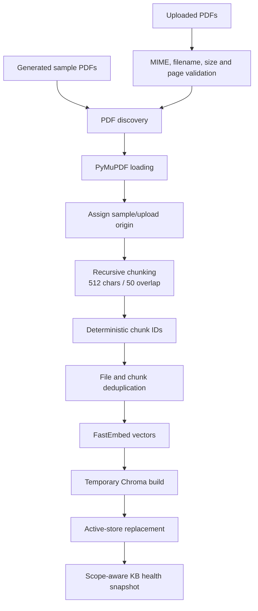
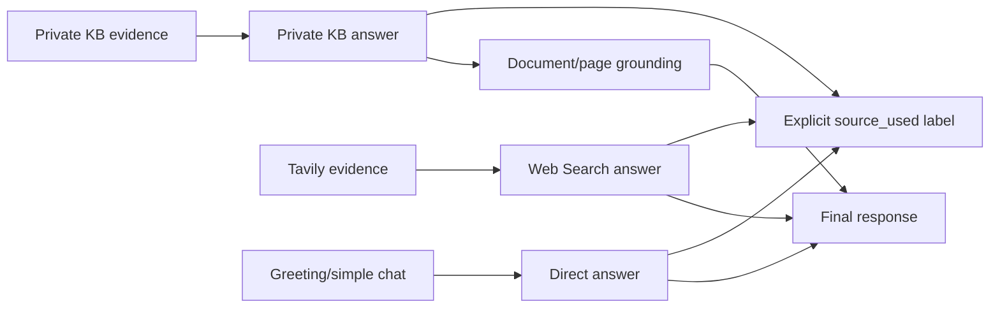
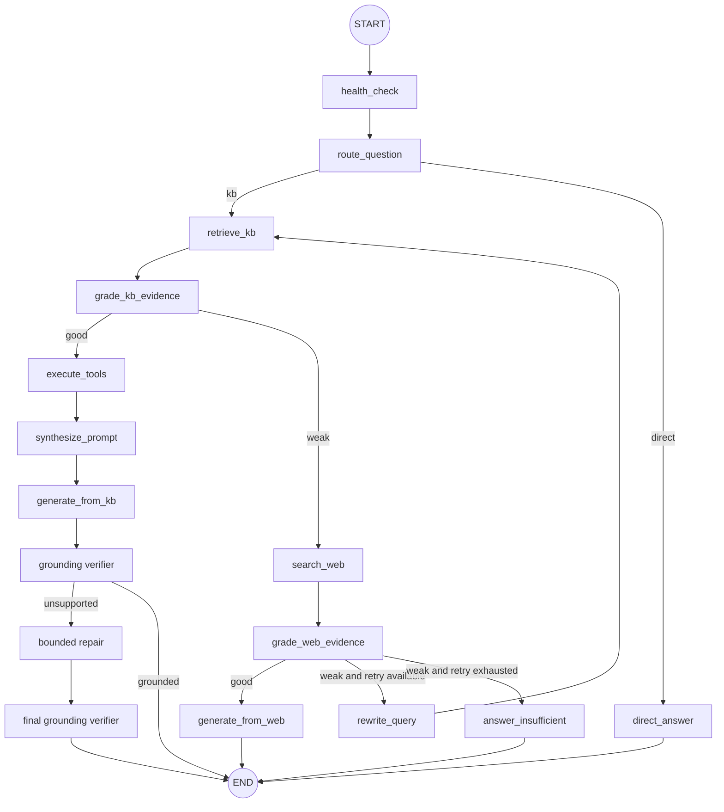

<div align="center">

# Internal RFP Analyst

### Cyclic Agentic RAG for evidence-grounded RFP analysis

Route questions, retrieve private knowledge, grade evidence, fall back to web search,
rewrite weak queries, execute deterministic RFP tools, and verify generated answers.

[](https://www.python.org/downloads/)
[](https://streamlit.io/)
[](https://github.com/langchain-ai/langgraph)
[](https://groq.com/)
[](https://tavily.com/)
[](#testing-and-evaluation)
[](#testing-and-evaluation)
[](https://github.com/tusharg007/Internal-RFP-Analyst/actions/workflows/ci.yml)

**Current package version: `0.1.0`**

[Overview](#overview) · [Architecture](#architecture) · [Workflow](#agentic-rag-workflow) · [Tech stack](#technology-stack) · [Walkthrough](#application-walkthrough) · [Structure](#project-structure) · [Setup](#quick-start) · [Testing](#testing-and-evaluation)

</div>

---

## Alternative GraphRAG Implementation

The Neo4j-based GraphRAG edition is available separately on
[`feature/graphrag-neo4j`](https://github.com/tusharg007/Internal-RFP-Analyst/tree/feature/graphrag-neo4j).
It adds provenance-aware graph retrieval alongside Chroma semantic evidence, with
`vector_only`, `graph_only`, and `hybrid` retrieval modes.

| Branch | Implementation |
| --- | --- |
| [`main`](https://github.com/tusharg007/Internal-RFP-Analyst/tree/main) | Original cyclic Agentic RAG + Chroma vector retrieval. |
| [`feature/graphrag-neo4j`](https://github.com/tusharg007/Internal-RFP-Analyst/tree/feature/graphrag-neo4j) | Neo4j GraphRAG + Chroma, supporting vector, graph, and hybrid retrieval. |

## Overview

Internal RFP Analyst is a local-first Streamlit application for searching private
consulting documents, comparing prior projects, analyzing uploaded RFPs, and creating
evidence-backed proposal material.

The current version is a cyclic Agentic RAG system rather than a linear
retrieve-and-generate pipeline. A LangGraph workflow decides:

- whether a question needs the private knowledge base or a direct answer;
- whether retrieved private evidence is strong enough;
- when Tavily web search should be used;
- when a weak query should be rewritten and retried;
- which deterministic RFP tools should execute;
- which generation prompt and source label should be used; and
- whether final claims are supported by cited document pages.

The project is a reproducible single-user demonstration with extensive regression and
evaluation coverage. It is not presented as a production multi-tenant platform.

## Current capabilities

- Generate a synthetic 10-document consulting case-study corpus.
- Upload and validate custom PDFs.
- Keep sample case studies and uploaded target documents in separate corpora.
- Build an idempotent ChromaDB knowledge base with deterministic chunk IDs.
- Route greetings and simple chat directly without retrieval.
- Search `sample`, `upload`, or `all` document scopes.
- Adapt retrieval for broad project inventories and resume/CV questions.
- Grade private-KB and web evidence with Pydantic structured output.
- Fall back to Tavily when private evidence is weak.
- Rewrite weak queries once and cycle back through retrieval.
- Extract RFP requirements and identify absent or ambiguous gaps.
- Rank internal case studies against target requirements.
- Compare projects across timeline, budget, technology stack, and outcomes.
- Build structured proposal outlines.
- Produce deterministic, fully cited project timeline catalogs.
- Generate separate Private KB, Web Search, and Direct answers.
- Verify citations, numbers, filenames, pages, and Markdown table rows.
- Perform one bounded repair pass for unsupported generated claims.
- Display safe source and tool traces without exposing private chain-of-thought.
- Degrade cleanly when an LLM, Tavily, a scope, or the vector store is unavailable.

## Architecture

### System architecture


```mermaid
flowchart LR
    User["User"] --> UI["Streamlit UI<br/>app.py"]
    UI --> Adapter["Application adapter<br/>agent.py"]
    Adapter --> Graph["Cyclic LangGraph runtime<br/>agent/graph.py"]
    Graph --> Router["Structured router"]
    Graph --> Graders["KB and web graders"]
    Graph --> Tools["Deterministic RFP tools"]
    Graph --> Generator["Path-specific generation"]
    Tools --> Retriever["Scoped adaptive retrieval"]
    Retriever --> Chroma["ChromaDB"]
    Chroma --> Embeddings["FastEmbed<br/>BAAI/bge-small-en-v1.5"]
    Graders --> Groq["Groq<br/>openai/gpt-oss-120b"]
    Graders -. optional fallback .-> Gemini["Gemini 2.0 Flash"]
    Graph --> Tavily["Tavily web search"]
    Generator --> Verify["Grounding verifier"]
    Verify --> Repair["Bounded answer repair"]
    Repair --> Response["Cited answer + source traces"]
    Verify --> Response
```

### Document ingestion


```mermaid
flowchart TD
    Samples["Generated sample PDFs"] --> Discovery["PDF discovery"]
    Uploads["Uploaded PDFs"] --> Validation["MIME, filename, size and page validation"]
    Validation --> Discovery
    Discovery --> Load["PyMuPDF loading"]
    Load --> Origin["Assign sample/upload origin"]
    Origin --> Chunk["Recursive chunking<br/>512 chars / 50 overlap"]
    Chunk --> IDs["Deterministic chunk IDs"]
    IDs --> Dedup["File and chunk deduplication"]
    Dedup --> Embed["FastEmbed vectors"]
    Embed --> Build["Temporary Chroma build"]
    Build --> Swap["Active-store replacement"]
    Swap --> Health["Scope-aware KB health snapshot"]
```

### Source trust boundary


```mermaid
flowchart LR
    Private["Private KB evidence"] --> PrivateAnswer["Private KB answer"]
    Web["Tavily evidence"] --> WebAnswer["Web Search answer"]
    Chat["Greeting/simple chat"] --> Direct["Direct answer"]
    PrivateAnswer --> Labels["Explicit source_used label"]
    WebAnswer --> Labels
    Direct --> Labels
    PrivateAnswer --> Grounding["Document/page grounding"]
    Grounding --> Final["Final response"]
    WebAnswer --> Final
    Direct --> Final
```

Private evidence is never silently presented as web evidence, and a direct answer never
claims retrieval occurred. The UI displays `Private KB`, `Web Search`, or `Direct`.

## Agentic RAG workflow

The canonical graph lives in
[`src/rfp_analyst/agent/graph.py`](src/rfp_analyst/agent/graph.py).


```mermaid
flowchart TD
    Start((START)) --> Health["health_check"]
    Health --> Route["route_question"]
    Route -->|kb| Retrieve["retrieve_kb"]
    Route -->|direct| Direct["direct_answer"]
    Retrieve --> GradeKB["grade_kb_evidence"]
    GradeKB -->|good| Execute["execute_tools"]
    GradeKB -->|weak| SearchWeb["search_web"]
    Execute --> Prompt["synthesize_prompt"]
    Prompt --> GenerateKB["generate_from_kb"]
    SearchWeb --> GradeWeb["grade_web_evidence"]
    GradeWeb -->|good| GenerateWeb["generate_from_web"]
    GradeWeb -->|weak and retry available| Rewrite["rewrite_query"]
    GradeWeb -->|weak and retry exhausted| Insufficient["answer_insufficient"]
    Rewrite --> Retrieve
    GenerateKB --> Verify["grounding verifier"]
    Verify -->|unsupported| Repair["bounded repair"]
    Repair --> FinalVerify["final grounding verifier"]
    Verify -->|grounded| End((END))
    FinalVerify --> End
    GenerateWeb --> End
    Direct --> End
    Insufficient --> End
```

The graph has three conditional edge sets:

1. **Router:** private KB vs direct answer.
2. **KB grade:** execute tools vs web search.
3. **Web grade:** generate, rewrite and retry, or stop with insufficient evidence.

The cycle is bounded by `MAX_QUERY_RETRIES=1`.

### Structured routing

`route_question` uses Pydantic `RouteDecision` output:

```python
llm.with_structured_output(RouteDecision, method="json_mode")
```

The schema allows only `kb` or `direct`. After `kb` is selected, deterministic refinement
preserves `compare`, `proposal`, and `rfp_analysis` intents. An offline-safe fallback
router keeps basic operation available when no provider can be reached.

### Adaptive private retrieval

Retrieval keeps `MIN_RELEVANCE_SCORE=0.50` as a pre-filter and adapts to request shape:

- **Project inventories** increase `k`, target samples, allow a bounded near-threshold
  candidate set, and preserve source diversity.
- **Resume/CV questions** target uploads, add skill-oriented search terms, and use
  filename-aware ranking so an identified resume is not lost to a generic score.
- **Cross-corpus analysis** treats uploads as target requirements and samples as internal
  case studies.

### Evidence grading and fallback

Private and web graders use the `EvidenceGrade` model with temperature `0.0`, returning
only `good` or `weak`. Clearly irrelevant private chunks are removed before grading.
When private evidence is weak, `langchain-tavily` searches for up to five results. Missing
keys, connection failures, and Tavily error dictionaries are treated as unavailable
evidence, not successful search results.

### Query rewriting

`QueryRewrite` produces a search-oriented query while preserving intent. Guards prevent
“what is in my resume?” from becoming generic resume advice and preserve complete
coverage for “all projects” requests.

### Deterministic tools

| Tool | Responsibility |
| --- | --- |
| `search_knowledge_base` | Scope-aware semantic retrieval and relevance pre-filtering |
| `project_catalog` | Deterministic timeline/duration table across project documents |
| `extract_rfp_requirements` | Extract target requirements |
| `find_relevant_case_studies` | Match internal case studies to requirements |
| `compare_projects` | Compare timeline, budget, stack, and outcomes |
| `proposal_writer` | Create a structured proposal outline |
| `grounding_verifier` | Validate claims against exact document/page evidence |

### Generation and grounding

- `KB_GENERATION_PROMPT` enforces Private KB citations and anti-hallucination rules.
- `WEB_GENERATION_PROMPT` permits only web evidence and URL citations.
- `DIRECT_ANSWER_PROMPT` handles simple conversation without fabricated retrieval.

Broad timeline catalogs bypass free-form table generation and render extracted fields
deterministically. Private-KB answers are then verified against exact PDF filenames,
Markdown-escaped names, page numbers, numeric ranges, filename years, and Markdown table
structure. One bounded repair pass removes or qualifies unsupported claims. Unsupported
table rows are dropped as rows instead of replaced by malformed free text.

## Technology stack

| Layer | Current technology |
| --- | --- |
| Language | Python 3.11+ |
| UI | Streamlit 1.38+ |
| Agent orchestration | LangGraph 0.2+ |
| RAG framework | LangChain 0.3+ |
| Primary LLM | Groq `openai/gpt-oss-120b` |
| Optional LLM fallback | Google `gemini-2.0-flash` |
| Structured output | Pydantic v2 + JSON mode |
| Web fallback | Tavily via `langchain-tavily` |
| Vector database | ChromaDB via `langchain-chroma` |
| Embeddings | FastEmbed `BAAI/bge-small-en-v1.5` |
| PDF ingestion | PyMuPDF |
| PDF generation | fpdf2 |
| Configuration | python-dotenv, environment variables, Streamlit Secrets |
| Evaluation data | YAML |
| Testing | pytest + Streamlit AppTest |
| CI | GitHub Actions |

> **Pinecone is not used in this version.** The active vector store is local ChromaDB,
> so no `PINECONE_API_KEY` is required.

## Application walkthrough

### 1. Configure providers

Copy `.env.example` to `.env`. Groq is the primary generation path; Tavily is required
only for live web fallback.

```dotenv
GROQ_API_KEY=gsk_...
GOOGLE_API_KEY=
TAVILY_API_KEY=tvly-...
```

Never commit `.env` or `.streamlit/secrets.toml`.

### 2. Start the UI

```powershell
python -m streamlit run app.py
```

The sidebar reports provider readiness, document/chunk counts, scope, pending uploads,
and the latest evaluation snapshot.

### 3. Create or upload documents

- **Generate Sample PDFs** creates the reproducible 10-project corpus.
- **Upload Custom PDFs** accepts resumes, RFPs, proposals, and other PDFs.
- **Ingest Documents** builds or rebuilds the knowledge base.

Unchanged uploader selections are idempotent: Streamlit reruns do not mark already
persisted files as pending again.

### 4. Choose document scope

| Scope | Meaning |
| --- | --- |
| All documents | Search samples and uploads |
| Sample documents only | Search internal case-study examples |
| Uploaded documents only | Search private uploaded files |

The graph can narrow `all` for strongly typed resume/CV or project-catalog requests.

### 5. Exercise the main paths

**Private KB**

```text
What technology stack was used for the banking digital audit?
```

**Broad project inventory**

```text
List all projects with their timelines.
```

This returns an intact row-cited table covering all 10 sample projects.

**Uploaded resume**

```text
What is my tech stack in the uploaded resume?
```

This targets uploaded evidence instead of turning the request into generic web advice.

**Web fallback**

```text
What are the latest external developments relevant to this technology?
```

**Direct answer**

```text
Hello! What can you help me with?
```

**Bounded insufficient evidence**

```text
Find evidence for the zxqv-991 nonexistent consulting initiative.
```

The final case attempts private retrieval, web fallback, one rewrite, and then returns an
honest insufficient-evidence response.

### 6. Inspect safe traces

Enable **Show Source Traces** to inspect the answer source, router intent, selected tools,
retrieval scope and `k`, filenames/pages/scores, evidence grades, retry count,
prompt-budget status, and grounding status. Hidden chain-of-thought is not displayed.

## Screenshots


## Project structure

```text
Internal-RFP-Analyst/
├── app.py                         # Streamlit UI and session lifecycle
├── agent.py                       # UI-facing LLM and graph adapter
├── config.py                      # Models, keys, thresholds, paths, budgets
├── rag_engine.py                  # Ingestion, stats, retrieval facade
├── document_generator.py          # Sample consulting PDF generator
├── requirements.txt
├── pyproject.toml
├── Makefile
├── .env.example
├── .github/workflows/ci.yml
├── src/rfp_analyst/
│   ├── agent/
│   │   ├── graph.py               # Cyclic graph and generation nodes
│   │   ├── router.py              # Structured KB/direct routing
│   │   ├── grader.py              # Structured KB/web grading
│   │   ├── query_rewriter.py      # Bounded query rewriting
│   │   ├── prompts.py             # Specialized prompts
│   │   ├── schemas_decisions.py   # RouteDecision/EvidenceGrade/QueryRewrite
│   │   ├── state.py
│   │   └── runtime.py
│   ├── ingestion/
│   │   ├── loaders.py
│   │   ├── chunking.py
│   │   ├── pipeline.py
│   │   └── registry.py
│   ├── retrieval/vector_store.py  # Chroma lifecycle and scoped search
│   ├── tools/
│   │   ├── compare_projects.py
│   │   ├── project_catalog.py     # Deterministic timeline catalog
│   │   ├── proposal_writer.py
│   │   ├── rfp_gap_analyzer.py
│   │   ├── search_kb.py
│   │   ├── source_verifier.py
│   │   └── web_search.py          # Tavily defensive adapter
│   ├── ui/helpers.py
│   ├── evals.py
│   ├── exceptions.py
│   ├── health.py
│   ├── schemas.py
│   └── uploads.py
├── evals/
│   ├── golden_questions.yaml      # KB/web/rewrite/catalog cases
│   ├── run_evals.py
│   └── run_kb_evals.py
├── tests/                          # 145 tests
├── docs/
└── data/
    ├── documents/                  # Generated; Git-ignored
    └── uploads/                    # Private; Git-ignored
```

`.venv/`, `vectorstore/`, caches, uploads, generated PDFs, and local reference notebooks
are deliberately excluded from Git.

## Quick start

### Windows PowerShell

```powershell
git clone https://github.com/tusharg007/Internal-RFP-Analyst.git
cd Internal-RFP-Analyst
py -3.11 -m venv .venv
Set-ExecutionPolicy -Scope Process -ExecutionPolicy RemoteSigned
.\.venv\Scripts\Activate.ps1
python -m pip install --upgrade pip
python -m pip install -r requirements.txt
python -m pip install -e ".[dev]"
Copy-Item .env.example .env
# Add GROQ_API_KEY and optionally TAVILY_API_KEY / GOOGLE_API_KEY.
python -m streamlit run app.py
```

### macOS / Linux

```bash
git clone https://github.com/tusharg007/Internal-RFP-Analyst.git
cd Internal-RFP-Analyst
python3.11 -m venv .venv
source .venv/bin/activate
python -m pip install --upgrade pip
python -m pip install -r requirements.txt
python -m pip install -e ".[dev]"
cp .env.example .env
# Add GROQ_API_KEY and optionally TAVILY_API_KEY / GOOGLE_API_KEY.
python -m streamlit run app.py
```

## Configuration

Secrets resolve in this order: Streamlit Secrets, OS environment variables, then `.env`.

| Setting | Default | Required | Purpose |
| --- | --- | --- | --- |
| `GROQ_API_KEY` | empty | One LLM provider for chat | Primary LLM |
| `GOOGLE_API_KEY` | empty | Optional | Gemini fallback |
| `TAVILY_API_KEY` | empty | Optional | Live web fallback |
| `AGENT_MODE` | `agentic` | No | Compatibility switch |
| `MIN_RELEVANCE_SCORE` | `0.50` | No | Retrieval pre-filter |
| `MAX_PROMPT_TOKENS` | `6500` | No | Input prompt budget |
| `RFP_ANALYSIS_MAX_OUTPUT_TOKENS` | `1200` | No | Analysis output reserve |
| `MAX_CONTEXT_CHARS_PER_CHUNK` | `1000` | No | Prompt compaction |
| `MAX_HISTORY_MESSAGES` | `3` | No | Included chat history |
| `MAX_TARGET_CHUNKS` | `4` | No | Target evidence cap |
| `MAX_CASE_STUDIES` | `3` | No | Case-study prompt cap |
| `MAX_CHUNKS_PER_CASE_STUDY` | `2` | No | Chunks per case study |
| `MAX_UPLOAD_SIZE_MB` | `25` | No | Upload size limit |
| `MAX_UPLOAD_PAGE_COUNT` | `250` | No | PDF page limit |
| `RFP_ANALYST_DEBUG` | `0` | No | Local provider details |

Important code defaults:

| Constant | Value |
| --- | --- |
| `GROQ_MODEL` | `openai/gpt-oss-120b` |
| `GEMINI_MODEL` | `gemini-2.0-flash` |
| `GENERATION_TEMPERATURE` | `0.3` |
| `GRADING_TEMPERATURE` | `0.0` |
| `TAVILY_MAX_RESULTS` | `5` |
| `MAX_QUERY_RETRIES` | `1` |
| `EMBEDDING_MODEL` | `BAAI/bge-small-en-v1.5` |
| `CHUNK_SIZE` / `CHUNK_OVERLAP` | `512` / `50` |
| `RETRIEVAL_K` | `6` before adaptive expansion |
| `COLLECTION_NAME` | `rfp_kb_v2` |

## Testing and evaluation

### Test suite

```powershell
python -m pytest -q
```

Latest verified result: **145 passed**.

Coverage includes configuration, ingestion, deduplication, scope isolation, graph paths,
structured routing/grading, rewrite bounds, Tavily degradation, adaptive resume retrieval,
project catalogs, grounding, Streamlit behavior, and runtime errors.

### Offline smoke evaluation

```powershell
python -m evals.run_evals
```

Latest result: **3/3**, pass rate **1.0**. This validates deterministic evaluation
plumbing against a mock corpus; it is not proof of live answer quality.

### Real knowledge-base evaluation

```powershell
python -m evals.run_kb_evals
```

Latest result: **9/9**, pass rate **1.0**.

This generates PDFs, ingests a temporary ChromaDB, and exercises real retrieval and graph
paths for sample retrieval, uploaded retrieval, cross-corpus analysis, prior citations,
unsupported queries, comparison, web fallback, bounded rewriting, and a complete 10-project
timeline inventory.

### Additional checks

```powershell
python -m py_compile app.py agent.py rag_engine.py config.py document_generator.py
python -m compileall -f src tests evals
python -m ruff check .
```

GitHub Actions compiles the project, runs pytest, and executes the offline smoke eval.

## Reliability and security

- Secrets, uploads, generated PDFs, vector stores, and local notebooks are Git-ignored.
- Tests do not load `.env` unless explicitly enabled.
- Uploads are validated for type, name, size, and page count.
- Unchanged files are not repeatedly marked pending.
- Ingestion builds a temporary store before replacing the active store.
- File/chunk deduplication makes repeated ingestion deterministic.
- Scope filters separate private uploads from internal samples.
- Failed web calls and error payloads are not accepted as evidence.
- Query retries and answer repair are bounded.
- Missing evidence returns an explicit fallback.
- Source traces expose operational summaries, not hidden reasoning.

## Deployment

For Streamlit Community Cloud, deploy `app.py`, install `requirements.txt`, and add keys
in Streamlit Secrets:

```toml
GROQ_API_KEY = "gsk_..."
TAVILY_API_KEY = "tvly-..."
# GOOGLE_API_KEY = "..."
```

The current Chroma design assumes one application instance. Multi-instance deployment
requires managed document/vector storage and tenant isolation.

## Known limitations

- Single-user Streamlit and local filesystem model.
- Local ChromaDB rather than a managed vector service.
- No authentication, authorization, or tenant isolation.
- Synthetic internal sample corpus and small eval corpus.
- Dense retrieval without a production reranker or hybrid BM25 layer.
- Heuristic grounding is bounded, not formal factual proof.
- Generation quality depends on the configured provider.
- Web fallback depends on Tavily and network availability.
- No background worker queue for large ingestion jobs.

## Troubleshooting

### Chat is disabled

Add `GROQ_API_KEY` or `GOOGLE_API_KEY`, restart Streamlit, and inspect the provider badge.

### Web fallback returns no evidence

Confirm `TAVILY_API_KEY` and network access. Network-error dictionaries are intentionally
treated as empty evidence.

### An uploaded PDF cannot be found

Confirm it was ingested, select Uploads or All, and inspect the trace. Resume/CV questions
automatically target uploads when the selected scope is All.

### Chroma is locked on Windows

Stop other Streamlit/evaluation processes using this repository before rebuilding. Do not
open the same persistent Chroma directory from multiple Python processes.

### Old answers remain after an upgrade

Restart Streamlit and clear chat history; persisted session messages are not regenerated.

## Additional documentation

- [`docs/ARCHITECTURE.md`](docs/ARCHITECTURE.md)
- [`docs/AGENTIC_RAG.md`](docs/AGENTIC_RAG.md)
- [`docs/FILE_MAP.md`](docs/FILE_MAP.md)
- [`docs/TESTING_AND_EVALUATION.md`](docs/TESTING_AND_EVALUATION.md)
- [`docs/REPRODUCIBILITY.md`](docs/REPRODUCIBILITY.md)
- [`docs/TROUBLESHOOTING.md`](docs/TROUBLESHOOTING.md)

## License and data notice

No license file is currently included. Review licensing requirements before distribution.
Do not commit client PDFs, resumes, vector stores, or API keys.
