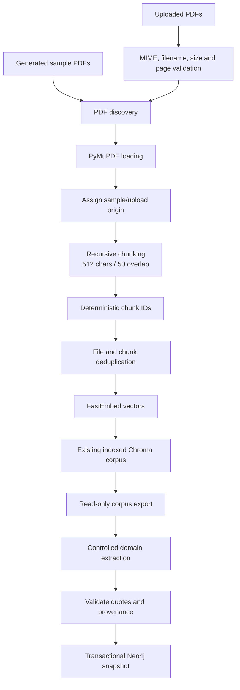
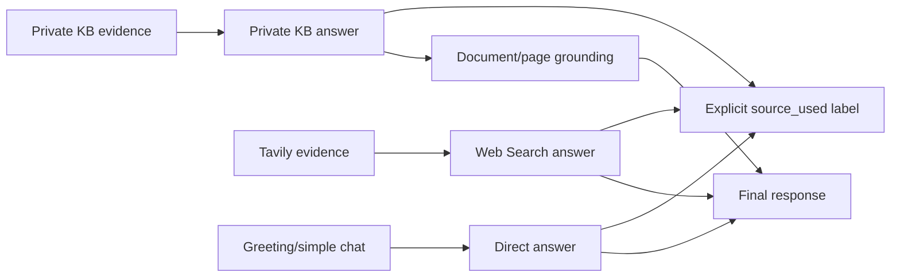
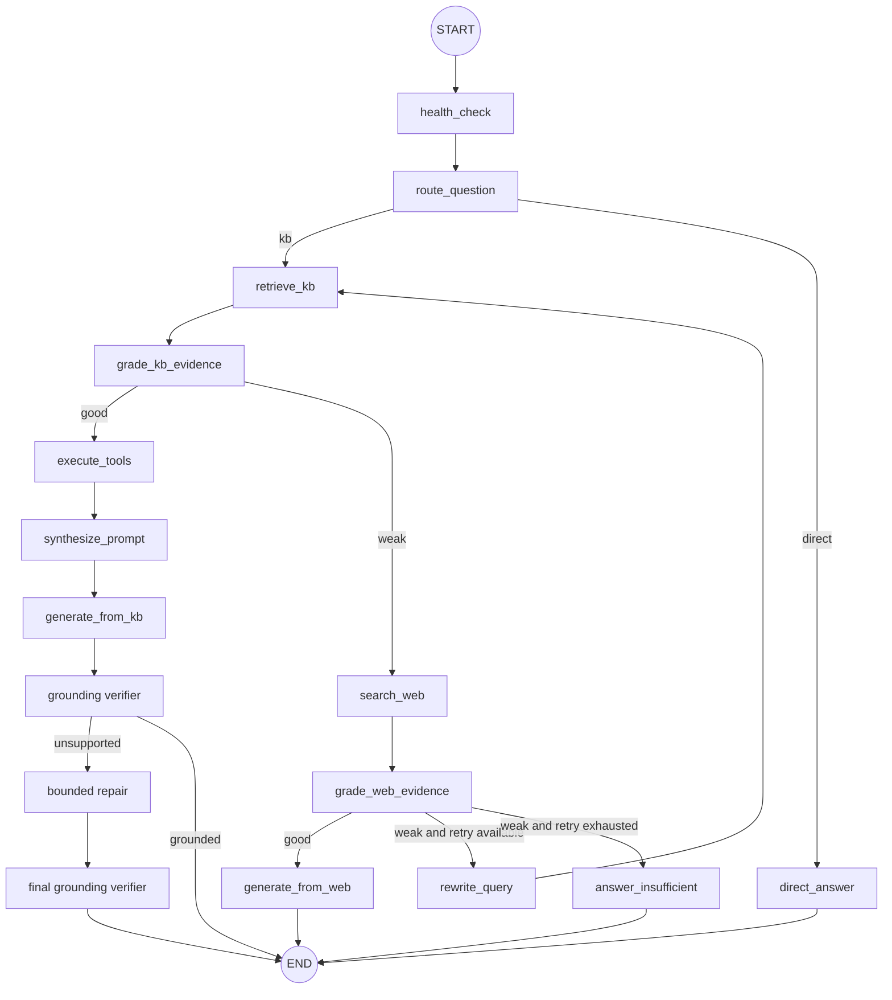

<div align="center">

# Internal RFP Analyst

### Provenance-aware GraphRAG for evidence-grounded RFP analysis

The GraphRAG edition of Internal RFP Analyst. It preserves the original Chroma-based
Agentic RAG workflow and adds optional Neo4j relationship retrieval; source chunks remain
the evidence supplied to answer generation and grounding.

[](https://www.python.org/downloads/)
[](https://streamlit.io/)
[](https://github.com/langchain-ai/langgraph)
[](https://groq.com/)
[](https://tavily.com/)
[](#evaluation)
[](https://github.com/tusharg007/Internal-RFP-Analyst/actions/workflows/ci.yml)

**Current package version: `0.1.0`**

[Overview](#overview) · [Architecture](#architecture) · [Graph schema](#neo4j-domain-schema) · [Setup](#quick-start) · [Evaluation](#evaluation) · [Structure](#project-structure)

</div>

---

## Overview

This branch is the **GraphRAG edition** of the existing Internal RFP Analyst. It
combines ChromaDB semantic retrieval, LangGraph orchestration, deterministic RFP tools,
and citation/grounding checks with an optional Neo4j domain graph for source-backed
relationships and multi-hop retrieval.

| Branch | Retrieval implementation |
| --- | --- |
| `main` | Original Agentic RAG with Chroma-based semantic retrieval. |
| `feature/graphrag-neo4j` | Chroma vector retrieval plus optional Neo4j GraphRAG: `vector_only`, `graph_only`, and `hybrid` modes. |

Graph support is optional. `vector_only` remains the default and works with Neo4j
disabled. Graph assertions help select relevant original evidence; they are not
independent proof and do not replace document/page grounding. This project does not
claim that graph or hybrid retrieval outperforms vector retrieval.

## Problem statement

RFP analysis often asks connected questions across case studies: which projects used a
technology in a given industry, which also mention a framework, what outcomes were
reported, or which prior projects appear relevant to a target requirement. Semantic
search is useful for finding passages, but does not explicitly represent typed
project-to-technology, industry, framework, requirement, and outcome relationships.

This branch adds a bounded graph projection to help find those relationships, then
hydrates graph witnesses from existing indexed Chroma chunks. Chroma remains the source
of original text evidence; graph retrieval does not independently generate facts.

## Why GraphRAG for RFP analysis?

RFP queries may combine constraints or compare entities across documents. Neo4j
represents the supported domain relationships extracted from the indexed corpus. This
makes relationship-oriented candidate selection explicit, while Chroma remains
responsible for semantic passage retrieval and original text. Hybrid retrieval combines
the two candidate sources; it is not assumed to be better in every case.

## Architecture

### System architecture


```mermaid
flowchart LR
    User["User"] --> UI["Streamlit UI<br/>app.py"]
    UI --> Adapter["Application adapter<br/>agent.py"]
    Adapter --> Graph["Cyclic LangGraph runtime<br/>agent/graph.py"]
    Graph --> Router["Existing KB/direct router"]
    Router --> Retrieval["Retrieval mode decision"]
    Retrieval -->|vector_only| Chroma["ChromaDB semantic search"]
    Retrieval -->|graph_only| Neo4j["Neo4j fixed-template projection"]
    Retrieval -->|hybrid| Hybrid["Neo4j + Chroma candidates"]
    Neo4j --> Hydrate["Validate graph provenance;<br/>hydrate original Chroma chunks"]
    Hybrid --> Hydrate
    Chroma --> Evidence["Deduplicate and rank evidence"]
    Hydrate --> Evidence
    Evidence --> Graders["Evidence grading"]
    Evidence --> Tools["Deterministic RFP tools"]
    Tools --> Generator["Path-specific generation"]
    Graders --> Generator
    Graph --> Tavily["Optional Tavily fallback"]
    Generator --> Verify["Citation/page grounding"]
    Verify --> Repair["Bounded answer repair"]
    Repair --> Response["Answer + source traces"]
    Verify --> Response
```

### Indexing and optional graph publication


```mermaid
flowchart TD
    Samples["Generated sample PDFs"] --> Discovery["PDF discovery"]
    Uploads["Uploaded PDFs"] --> Validation["MIME, filename, size and page validation"]
    Validation --> Discovery
    Discovery --> Load["PyMuPDF loading"]
    Load --> Origin["Assign sample/upload origin"]
    Origin --> Chunk["Recursive chunking<br/>512 chars / 50 overlap"]
    Chunk --> IDs["Deterministic chunk IDs"]
    IDs --> Dedup["File and chunk deduplication"]
    Dedup --> Embed["FastEmbed vectors"]
    Embed --> Chroma["Existing indexed Chroma corpus"]
    Chroma --> Export["Read-only corpus export"]
    Export --> Extract["Controlled domain extraction"]
    Extract --> Validate["Validate quotes and provenance"]
    Validate --> Snapshot["Transactional Neo4j snapshot"]
```

PDF indexing into Chroma and graph snapshot publication are separate operations. The
graph rebuild consumes the already indexed collection; it does not replace Chroma's
document-ingestion workflow.

### Source trust boundary


```mermaid
flowchart LR
    Private["Private KB evidence"] --> PrivateAnswer["Private KB answer"]
    Web["Tavily evidence"] --> WebAnswer["Web Search answer"]
    Chat["Greeting/simple chat"] --> Direct["Direct answer"]
    PrivateAnswer --> Labels["Explicit source_used label"]
    WebAnswer --> Labels
    Direct --> Labels
    PrivateAnswer --> Grounding["Document/page grounding"]
    Grounding --> Final["Final response"]
    WebAnswer --> Final
    Direct --> Final
```

Private evidence is never silently presented as web evidence, and a direct answer never
claims retrieval occurred. The UI displays `Private KB`, `Web Search`, or `Direct`.

## Retrieval modes

Set `RFP_RETRIEVAL_MODE` to `vector_only` (default), `graph_only`, `hybrid`, or `auto`.
The retrieval decision is deterministic and based on query characteristics; the
existing LLM router separately decides KB versus direct answer.

| Mode | Behavior and intended fit |
| --- | --- |
| `vector_only` | Existing Chroma semantic search for summaries, narrative questions, and passage-finding. |
| `graph_only` | Bounded Neo4j relationship/field projection, followed by validation and retrieval of supporting original chunks. |
| `hybrid` | Combines graph witnesses and vector candidates, deduplicates them, then ranks/fuses original text evidence. |
| `auto` | Chooses by query shape: prose/passages favor vectors; structured relationships and connected constraints may select graph or hybrid. |

Graph failures are explicit in traces. Production graph modes may degrade to vector
retrieval when graph service or synchronized-snapshot requirements are not met; strict
evaluation graph-only mode refuses that fallback. Requested and effective modes remain
distinct. See [Graph retrieval](docs/GRAPH_RETRIEVAL.md) for safety and fallback details.

## Neo4j domain schema

The schema is deliberately small and corpus-specific. It does not add generic `Client`,
`Capability`, or inferred `SATISFIES` nodes/edges.

| Label | Role / representative properties |
| --- | --- |
| `RFPDocument` | Indexed source identity: `document_id`, `source_file`, `document_origin`, `file_hash`, document `kind`, `revision`, `access_partition`, `corpus_id`, `corpus_version`. |
| `RFPChunk` | Original Chroma evidence anchor: `evidence_id`, existing `chunk_id`, document/source/origin/hash, zero-based `page_index`, `text_hash`, `span_start`, `span_end`, `span_scope`, corpus identifiers. |
| `RFPDomainEntity` | Controlled `kind` (`Project`, `Requirement`, `Technology`, `Industry`, `ComplianceFramework`), canonical `entity_id` and `name`, plus document identity where applicable. |
| `RFPAssertion` | `assertion_id`, `subject_id`, `object_id`, `evidence_id`, `subject_kind`, `requirement`, `predicate`, `object_name`, `value`, `unit`, `modality`, `quote`, `start`, `end`, `confidence`, `extraction_method`, `extractor_version`, `review_status`, corpus identifiers. |
| `RFPSnapshot` | `corpus_id`, `corpus_version`, `indexed_digest`, extractor/normalization/format/chunker/embedding version descriptors, coverage, document/chunk/entity/assertion counts, and `ingested_at`. |
| `RFPCorpusHead` | `corpus_id` and active `active_version` pointer. |

Fixed relationships are `RFPChunk-[:IN_DOCUMENT]->RFPDocument`;
`RFPDomainEntity-[:IN_DOCUMENT]->RFPDocument` and
`RFPDomainEntity-[:SUPPORTED_BY]->RFPChunk` for identity support;
`Project|Requirement-[:HAS_ASSERTION]->RFPAssertion`;
`RFPAssertion-[:SUPPORTED_BY]->RFPChunk`; and
`RFPAssertion-[:OBJECT]->RFPDomainEntity` for entity-valued facts. Support edges carry
span metadata such as `start`, `end`, and `span_scope`.

Allowed assertion predicates are `uses_technology`, `in_industry`, `mentions_framework`,
`requires_technology`, `requires_framework`, `timeline`, `budget`, and `outcome`.
Outcome modality is retained. A framework mention or proposed control is not proof of
compliance/certification; a projected outcome is not reported as achieved.

## Provenance design

Each graph fact points to an indexed document and supporting original Chroma chunk.
Document identity includes filename, origin, and file hash; chunk identity retains the
existing Chroma chunk ID and content hash, page index, and explicit span scope. Extraction
validates quotes and spans against original chunk text and publishes versioned snapshots.
Graph retrieval validates the active snapshot and hydrates evidence from indexed text
before generation.

The indexed corpus currently does not retain source-page character offsets for graph
facts. Accordingly, extraction marks its validated quote spans as chunk-local
(`span_scope=chunk`) rather than presenting them as page-coordinate offsets. Page numbers
remain attached to the original chunk for citations.

This provides source/chunk/path traceability, **not** a formal claim-to-evidence graph
for every sentence in a generated answer or a semantic entailment proof. Final answer
citations and grounding continue to use the existing document/page verifier.

## Graph query safety

User questions do not become arbitrary Cypher. Runtime retrieval uses fixed query
templates with parameterized values, a fixed label/relationship vocabulary, read access,
and bounded projection/traversal/result budgets. No generic Cypher tool or
write-capable LLM-generated graph query is exposed. Application read-mode safeguards do
not substitute for Neo4j server-side privileges; database-level RBAC has not been
verified in this repository's test run.

## Agentic RAG workflow

The canonical graph lives in
[`src/rfp_analyst/agent/graph.py`](src/rfp_analyst/agent/graph.py).


```mermaid
flowchart TD
    Start((START)) --> Health["health_check"]
    Health --> Route["route_question"]
    Route -->|kb| Retrieve["retrieve_kb"]
    Route -->|direct| Direct["direct_answer"]
    Retrieve --> GradeKB["grade_kb_evidence"]
    GradeKB -->|good| Execute["execute_tools"]
    GradeKB -->|weak| SearchWeb["search_web"]
    Execute --> Prompt["synthesize_prompt"]
    Prompt --> GenerateKB["generate_from_kb"]
    SearchWeb --> GradeWeb["grade_web_evidence"]
    GradeWeb -->|good| GenerateWeb["generate_from_web"]
    GradeWeb -->|weak and retry available| Rewrite["rewrite_query"]
    GradeWeb -->|weak and retry exhausted| Insufficient["answer_insufficient"]
    Rewrite --> Retrieve
    GenerateKB --> Verify["grounding verifier"]
    Verify -->|unsupported| Repair["bounded repair"]
    Repair --> FinalVerify["final grounding verifier"]
    Verify -->|grounded| End((END))
    FinalVerify --> End
    GenerateWeb --> End
    Direct --> End
    Insufficient --> End
```

The graph has three conditional edge sets:

1. **Router:** private KB vs direct answer.
2. **KB grade:** execute tools vs web search.
3. **Web grade:** generate, rewrite and retry, or stop with insufficient evidence.

The cycle is bounded by `MAX_QUERY_RETRIES=1`.

### Structured routing

`route_question` uses Pydantic `RouteDecision` output:

```python
llm.with_structured_output(RouteDecision, method="json_mode")
```

The schema allows only `kb` or `direct`. After `kb` is selected, deterministic refinement
preserves `compare`, `proposal`, and `rfp_analysis` intents. An offline-safe fallback
router keeps basic operation available when no provider can be reached.

### Adaptive private retrieval

Retrieval keeps `MIN_RELEVANCE_SCORE=0.50` as a pre-filter and adapts to request shape:

- **Project inventories** increase `k`, target samples, allow a bounded near-threshold
  candidate set, and preserve source diversity.
- **Resume/CV questions** target uploads, add skill-oriented search terms, and use
  filename-aware ranking so an identified resume is not lost to a generic score.
- **Cross-corpus analysis** treats uploads as target requirements and samples as internal
  case studies.

### Evidence grading and fallback

Private and web graders use the `EvidenceGrade` model with temperature `0.0`, returning
only `good` or `weak`. Clearly irrelevant private chunks are removed before grading.
When private evidence is weak, `langchain-tavily` searches for up to five results. Missing
keys, connection failures, and Tavily error dictionaries are treated as unavailable
evidence, not successful search results.

### Query rewriting

`QueryRewrite` produces a search-oriented query while preserving intent. Guards prevent
“what is in my resume?” from becoming generic resume advice and preserve complete
coverage for “all projects” requests.

### Deterministic tools

| Tool | Responsibility |
| --- | --- |
| `search_knowledge_base` | Scope-aware semantic retrieval and relevance pre-filtering |
| `project_catalog` | Deterministic timeline/duration table across project documents |
| `extract_rfp_requirements` | Extract target requirements |
| `find_relevant_case_studies` | Match internal case studies to requirements |
| `compare_projects` | Compare timeline, budget, stack, and outcomes |
| `proposal_writer` | Create a structured proposal outline |
| `grounding_verifier` | Validate claims against exact document/page evidence |

### Generation and grounding

- `KB_GENERATION_PROMPT` enforces Private KB citations and anti-hallucination rules.
- `WEB_GENERATION_PROMPT` permits only web evidence and URL citations.
- `DIRECT_ANSWER_PROMPT` handles simple conversation without fabricated retrieval.

Broad timeline catalogs bypass free-form table generation and render extracted fields
deterministically. Private-KB answers are then verified against exact PDF filenames,
Markdown-escaped names, page numbers, numeric ranges, filename years, and Markdown table
structure. One bounded repair pass removes or qualifies unsupported claims. Unsupported
table rows are dropped as rows instead of replaced by malformed free text.

## Technology stack

| Layer | Current technology |
| --- | --- |
| Language | Python 3.11+ |
| UI | Streamlit |
| Agent orchestration | LangGraph |
| LLM integration | LangChain; Groq `openai/gpt-oss-120b` and Google `gemini-3.8-flash` configuration |
| Structured output | Pydantic v2 + JSON mode |
| Web fallback | Tavily via `langchain-tavily` |
| Vector store / embeddings | ChromaDB via `langchain-chroma`; FastEmbed `BAAI/bge-small-en-v1.5` |
| Graph store | Optional Neo4j via the Neo4j Python driver |
| Semantic evaluation | Optional RAGAS; configurable Google or Groq judge |
| PDF ingestion | PyMuPDF |
| PDF generation | fpdf2 |
| Configuration | python-dotenv, environment variables, Streamlit Secrets |
| Evaluation data | YAML |
| Testing | pytest |
| CI | GitHub Actions |

RAGAS is evaluation infrastructure, not part of the normal user-facing retrieval path.

## Example GraphRAG query

```text
Which healthcare projects used Microsoft Azure and had compliance requirements,
and what source-backed outcomes were reported?
```

Depending on the retrieval policy, this relationship-oriented query can use a bounded
graph projection or hybrid retrieval. Supporting source chunks are retrieved from the
existing index and passed through the same evidence grading and answer grounding as
other KB queries. The example describes intended behavior, not a benchmark result.

## Running the application

1. Install the core requirements and editable package using [Quick start](#quick-start).
2. Configure an application LLM key in `.env` or Streamlit Secrets. Configure Tavily only
   if live web fallback is desired.
3. Start the UI:

   ```powershell
   python -m streamlit run app.py
   ```

4. Generate or upload PDFs in the sidebar and use **Ingest Documents** to build the
   Chroma index. Neo4j publication is a separate, explicit operation; it does not run
   automatically as part of a chat request.
5. Optionally enable graph retrieval after configuring Neo4j, publishing a matching
   snapshot, and selecting a graph retrieval mode.

The source trace distinguishes requested/effective retrieval modes and shows operational
evidence metadata; it does not expose private chain-of-thought. Streamlit answer source
labels remain `Private KB`, `Web Search`, and `Direct`.

## Screenshots


## Project structure

```text
Internal-RFP-Analyst/
├── app.py                         # Streamlit UI
├── agent.py                       # Application adapter
├── config.py                      # Environment/secrets and model settings
├── rag_engine.py                  # Chroma ingestion and retrieval facade
├── document_generator.py          # Public sample PDF generation
├── requirements*.txt / pyproject.toml
├── .env.example
├── .github/workflows/ci.yml
├── src/rfp_analyst/
│   ├── agent/                      # LangGraph, prompts, routing, grading, state
│   ├── graph/                      # Neo4j schema, store, extraction, snapshots, reader
│   ├── ingestion/                  # PDF loaders, chunking and indexing pipeline
│   ├── retrieval/                  # Vector retrieval and graph/hybrid provider
│   ├── tools/                      # KB, RFP, project and web tools
│   └── ui/                         # Streamlit helpers
├── evals/                          # Frozen cases, deterministic runners, RAGAS,
│   │                               # matched capture and quota-safe resume/merge
│   └── retrieval_questions.yaml
├── tests/                          # Unit/regression and opt-in Neo4j integration tests
└── docs/                           # Architecture, operations, evaluation and audits
```

Local indexes, caches, uploads, generated PDFs, and secrets should not be committed.

## Quick start

### Windows PowerShell

```powershell
git clone --branch feature/graphrag-neo4j https://github.com/tusharg007/Internal-RFP-Analyst.git
cd Internal-RFP-Analyst
py -3.11 -m venv .venv
Set-ExecutionPolicy -Scope Process -ExecutionPolicy RemoteSigned
.\.venv\Scripts\Activate.ps1
python -m pip install --upgrade pip
python -m pip install -r requirements.txt
python -m pip install -e ".[dev]"
Copy-Item .env.example .env
# Add an application model key; Tavily is optional for web fallback.
python -m streamlit run app.py
```

### macOS / Linux

```bash
git clone --branch feature/graphrag-neo4j https://github.com/tusharg007/Internal-RFP-Analyst.git
cd Internal-RFP-Analyst
python3.11 -m venv .venv
source .venv/bin/activate
python -m pip install --upgrade pip
python -m pip install -r requirements.txt
python -m pip install -e ".[dev]"
cp .env.example .env
# Add an application model key; Tavily is optional for web fallback.
python -m streamlit run app.py
```

## Configuration

Copy `.env.example` to `.env` and add credentials only on your machine. Secrets resolve
from Streamlit Secrets, environment variables, then `.env`. Never put real credentials
in source control or evaluation artifacts.

| Setting | Purpose |
| --- | --- |
| `GROQ_API_KEY`, `GOOGLE_API_KEY` | Application model keys; configured models are Groq `openai/gpt-oss-120b` and Gemini `gemini-3.8-flash`. |
| `TAVILY_API_KEY` | Optional external web fallback. |
| `NEO4J_ENABLED` | Optional graph infrastructure switch; default `false`. |
| `NEO4J_URI`, `NEO4J_DATABASE` | Neo4j endpoint and database. Do not embed credentials in the URI. |
| `NEO4J_USERNAME`, `NEO4J_PASSWORD` | Runtime graph reader identity. |
| `NEO4J_INGEST_USERNAME`, `NEO4J_INGEST_PASSWORD` | Separate graph ingestion identity. |
| `NEO4J_ADMIN_USERNAME`, `NEO4J_ADMIN_PASSWORD` | Explicit schema/migration identity. |
| `RFP_RETRIEVAL_MODE` | `vector_only` (default), `graph_only`, `hybrid`, or `auto`. |
| `RFP_GRAPH_CORPUS_ID` | Active graph corpus identifier; defaults to `internal-rfp`. |
| `RAGAS_JUDGE_PROVIDER`, `RAGAS_JUDGE_MODEL`, `RAGAS_JUDGE_API_KEY` | Optional semantic-evaluation judge configuration. |

`NEO4J_ENABLED=true` alone does not publish graph data or select graph retrieval. Neo4j
must have its schema initialized and a snapshot matching the indexed corpus. Install
optional packages only when using these features:

```powershell
python -m pip install -r requirements-graph.txt
python -m pip install -r requirements-eval.txt
```

The first installs the Neo4j driver; the second installs optional RAGAS evaluation
dependencies. Neither is required for vector-only application use.

## Graph ingestion and rebuild

Graph ingestion reads the **existing indexed Chroma collection**. It does not create a
new vector collection, re-embed text, or ingest raw PDFs itself. Quiesce vector ingestion
while publishing a graph snapshot, and use the same corpus ID for schema, rebuild, and
runtime retrieval.

```powershell
# Configure NEO4J_ENABLED=true and the separate admin/ingestion credentials first.
python -m rfp_analyst.graph init-schema

# Validate the current index and extraction without graph writes.
python -m rfp_analyst.graph rebuild --dry-run --corpus-id internal-rfp

# Publish a new versioned snapshot from the existing configured Chroma index.
python -m rfp_analyst.graph rebuild --corpus-id internal-rfp
```

To use another already-indexed store, pass `--persist-dir <index-directory>` and
`--collection <existing-collection>`. The CLI requires an existing index and collection;
it will not silently create one. It validates source metadata and extraction before an
atomic transactional graph publication. See [Graph ingestion](docs/GRAPH_INGESTION.md)
and [Graph retrieval](docs/GRAPH_RETRIEVAL.md).

The CLI's default extractor is deterministic and parses known case-study/RFP sections
using the fixed Pydantic schema and curated normalization aliases. Structured LLM
extraction is an explicitly injected service option, not automatically enabled by an API
key. Invalid, unsupported, or source-unvalidated facts reject the snapshot rather than
being silently published.

## Evaluation

Run the regression suite and existing evaluations separately:

```powershell
python -m pytest -q
python -m evals.run_evals
python -m evals.run_kb_evals
```

The latest recorded full suite for this checkout is **613 passed, 5 skipped, 0 failed**.
Skipped live Neo4j integration tests do not prove database-level RBAC or live-server
behavior. Offline and deterministic evaluations check expected sources/tools/routes,
retrieval mode, provenance coverage, no-answer behavior, and existing grounding controls;
they do not by themselves prove semantic answer quality.

### Frozen retrieval comparison

The matched public protocol freezes one public Chroma corpus and one question set across
`vector_only`, `graph_only`, and `hybrid`. The frozen fixture has **11 documents and 54
chunks**; its extension has **16 cases** across semantic, factual, relationship,
multi-hop, cross-document, requirement-matching, unsupported, and ambiguous queries.
That defines **48 planned executions** (each case in each mode), not a completed result.
Before interpretation, the runner verifies the Chroma corpus manifest against the Neo4j
snapshot digest and records the same experiment metadata. A mismatch or unavailable graph
invalidates the comparison rather than counting as a graph retrieval loss or win.

Capture-only and semantic judging are distinct. The current matched comparison is
**incomplete**: a valid three-way retrieval-quality comparison has not been established.
Do not interpret partial captures as quality metrics or claim GraphRAG superiority. The
current status and limitations are recorded in
[GRAPHRAG_EVALUATION.md](docs/GRAPHRAG_EVALUATION.md).

The matched capture runner (capture only; no RAGAS judge) is:

```powershell
$Index = "PATH_TO_EXISTING_FROZEN_CHROMA_INDEX"
python -m evals.retrieval_benchmark --index $Index --collection rfp_kb_v2 --capture-only
```

Use a frozen public corpus and publish that exact manifest into an isolated Neo4j
evaluation corpus before interpreting graph/hybrid runs. Follow the evaluation document
for freeze, parity verification, provider quota, and report-merging requirements.

### Deterministic evaluation and RAGAS

The existing deterministic harness remains the fast, non-judge regression layer. The
optional RAGAS adapter evaluates actual application outputs using the exact contexts
captured at the generation boundary—there is no second retrieval to recreate contexts.
It supports Faithfulness, Answer Relevancy, Context Precision, Context Recall, and
Answer Correctness only where an independent reference exists. Route/tool/mode
correctness, expected sources, grounding, and no-answer behavior remain deterministic
checks rather than LLM-judge claims.

RAGAS requires its optional dependencies and an explicitly configured judge provider/model.
The capture-only option does not run a judge; `--allow-judge` authorizes external judge
calls and may send captured questions, answers, and evidence to that provider. No usable
matched semantic baseline is currently established.

```powershell
$Index = "PATH_TO_EXISTING_FROZEN_CHROMA_INDEX"
python -m evals.run_ragas --mode vector --questions evals/retrieval_questions.yaml --index $Index --collection rfp_kb_v2 --capture-only
python -m evals.run_ragas --mode graph --questions evals/retrieval_questions.yaml --index $Index --collection rfp_kb_v2 --capture-only
python -m evals.run_ragas --mode hybrid --questions evals/retrieval_questions.yaml --index $Index --collection rfp_kb_v2 --capture-only
```

These RAGAS adapter captures execute the application and require its generation provider;
they omit only the semantic judge. Replace the placeholder with the same frozen index for
each run. Use the matched retrieval benchmark above when producing a corpus-parity-locked
three-mode ablation.

Quota-safe resumable Groq capture is evaluation-only and does not initialize RAGAS.
It requires checking provider quota and explicit operator confirmation after a daily
quota reset; it does not retry a failed 429 or classify unexecuted cases as failures.
See [resumable capture operations](docs/GROQ_RESUMABLE_CAPTURE.md) before using its
`smoke`, `run-batch`, or `merge` commands.

```powershell
# Only after verifying the provider's daily quota reset:
python -m evals.resumable_groq_capture smoke --confirm-tpd-reset
python -m evals.resumable_groq_capture run-batch --confirm-tpd-reset --batch-size 2
# Merge only after all frozen case/mode executions have completed under identical metadata.
$Experiment = "EXPERIMENT_HASH"
$BatchGlob = "evals/results/resumable-groq/$Experiment/batches/batch-*.json"
$MergedReport = "evals/results/resumable-groq/$Experiment/merged.json"
python -m evals.resumable_groq_capture merge --batches $BatchGlob --output $MergedReport
```

CI runs compile checks, pytest, and the offline smoke evaluation; it does not call live
LLM judges or establish live Neo4j availability.

## Reliability and security

- Secrets, uploads, generated PDFs, vector stores, and local notebooks are Git-ignored.
- Tests do not load `.env` unless explicitly enabled.
- Uploads are validated for type, name, size, and page count.
- Unchanged files are not repeatedly marked pending.
- Ingestion builds a temporary store before replacing the active store.
- File/chunk deduplication makes repeated ingestion deterministic.
- Scope filters separate private uploads from internal samples.
- Failed web calls and error payloads are not accepted as evidence.
- Query retries and answer repair are bounded.
- Missing evidence returns an explicit fallback.
- Source traces expose operational summaries, not hidden reasoning.

## Deployment

For a single-instance Streamlit deployment, install `requirements.txt` and store keys in
the platform's secret manager/Streamlit Secrets. Do not copy real credentials into docs:

```toml
GROQ_API_KEY = "<secret>"
TAVILY_API_KEY = "<optional-secret>"
# GOOGLE_API_KEY = "<optional-secret>"
```

Graph deployments also require an externally provisioned Neo4j service, matching corpus
snapshot, and independently configured reader/ingestion/admin identities. This README
does not claim Neo4j server-level RBAC has been verified. The application is not a
production multi-tenant service; deployment behind an appropriate authentication and
authorization boundary remains an operator responsibility.

## Known limitations

- The application does not implement production multi-tenancy or an authenticated
  per-user document ACL. Document scope is a retrieval filter, not authorization.
- Neo4j database-level RBAC has not been verified by skipped unit/integration tests;
  configure and independently test least-privilege server identities before deployment.
- The graph ontology and deterministic extraction support known RFP/case-study fields;
  arbitrary capabilities, broad contract logic, and generic entity extraction are not
  represented as graph facts.
- Graph assertion/path provenance leads to source chunks, not a formal link from each
  generated answer claim to supporting evidence. The existing grounding checks are
  heuristic controls, not proof of semantic entailment.
- Chroma is the original text/evidence store. Neo4j is optional and graph snapshots must
  be rebuilt when the indexed corpus changes; graph ingestion is not a distributed,
  multi-transaction background worker.
- The frozen vector/graph/hybrid comparison is incomplete; no mode has been shown to
  outperform another. The public frozen fixture is small and cannot establish general
  production performance.
- RAGAS is optional evaluation infrastructure. No complete matched semantic baseline
  is established; judge outputs are not factual proof and provider quota can interrupt
  runs.
- Generation quality depends on the configured provider; web fallback depends on Tavily
  and network availability.

## Troubleshooting

### Chat is disabled

Add `GROQ_API_KEY` or `GOOGLE_API_KEY`, restart Streamlit, and inspect the provider badge.

### Web fallback returns no evidence

Confirm `TAVILY_API_KEY` and network access. Network-error dictionaries are intentionally
treated as empty evidence.

### An uploaded PDF cannot be found

Confirm it was ingested, select Uploads or All, and inspect the trace. Resume/CV questions
automatically target uploads when the selected scope is All.

### Chroma is locked on Windows

Stop other Streamlit/evaluation processes using this repository before rebuilding. Do not
open the same persistent Chroma directory from multiple Python processes.

### Old answers remain after an upgrade

Restart Streamlit and clear chat history; persisted session messages are not regenerated.

## Additional documentation

- [`docs/ARCHITECTURE.md`](docs/ARCHITECTURE.md)
- [`docs/AGENTIC_RAG.md`](docs/AGENTIC_RAG.md)
- [`docs/GRAPH_INGESTION.md`](docs/GRAPH_INGESTION.md)
- [`docs/GRAPH_RETRIEVAL.md`](docs/GRAPH_RETRIEVAL.md)
- [`docs/GRAPHRAG_EVALUATION.md`](docs/GRAPHRAG_EVALUATION.md)
- [`docs/RAGAS_EVALUATION.md`](docs/RAGAS_EVALUATION.md)
- [`docs/GROQ_RESUMABLE_CAPTURE.md`](docs/GROQ_RESUMABLE_CAPTURE.md)
- [`docs/PRODUCTION_READINESS_AUDIT.md`](docs/PRODUCTION_READINESS_AUDIT.md)
- [`docs/FILE_MAP.md`](docs/FILE_MAP.md)
- [`docs/TESTING_AND_EVALUATION.md`](docs/TESTING_AND_EVALUATION.md)
- [`docs/REPRODUCIBILITY.md`](docs/REPRODUCIBILITY.md)
- [`docs/TROUBLESHOOTING.md`](docs/TROUBLESHOOTING.md)

## License and data notice

No license file is currently included. Review licensing requirements before distribution.
Do not commit client PDFs, resumes, vector stores, or API keys.
