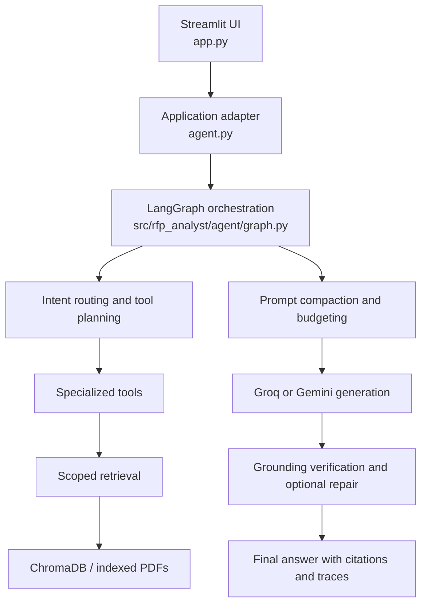
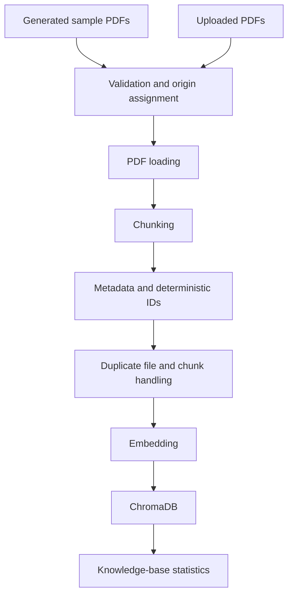
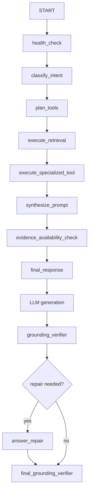
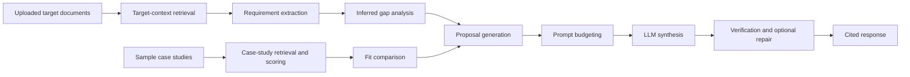
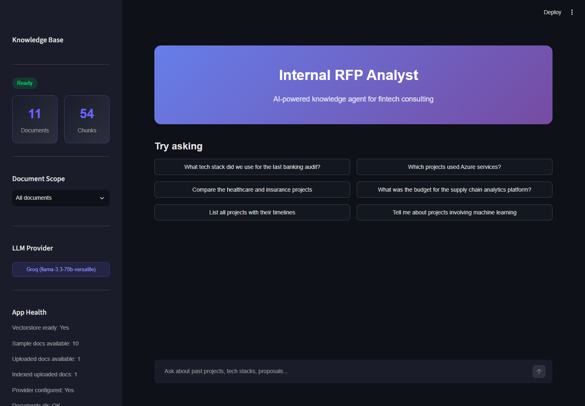
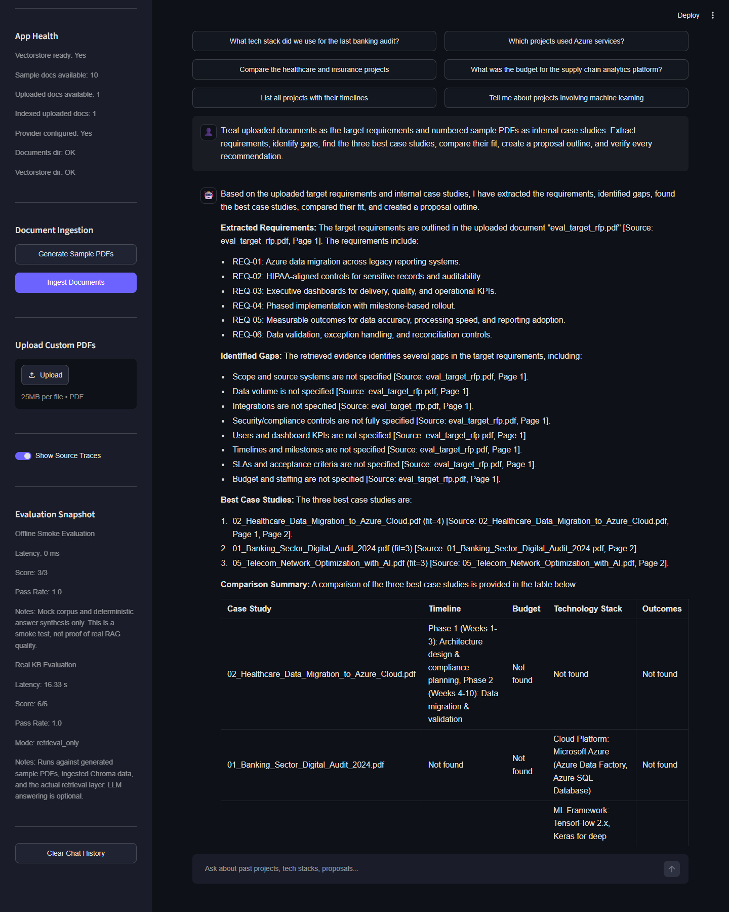
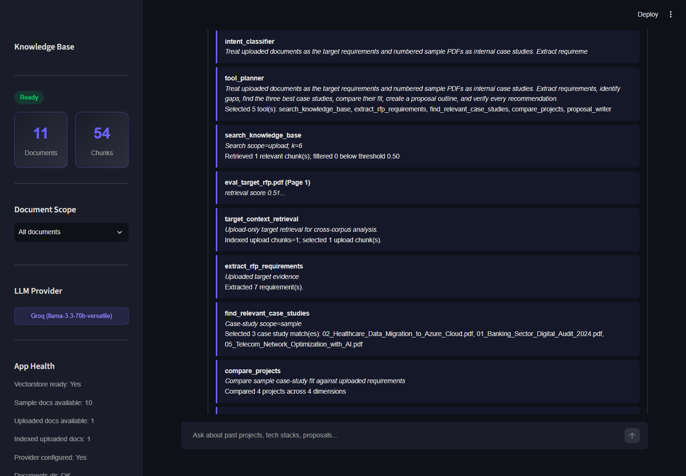
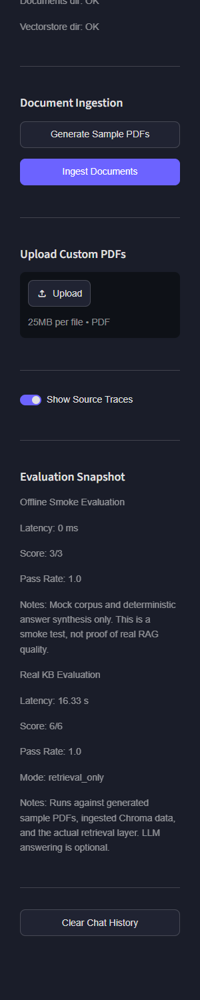

[](https://github.com/tusharg007/Internal-RFP-Analyst/actions/workflows/ci.yml)

# Internal RFP Analyst

## Agentic RAG for Cross-Corpus RFP Analysis

Tool-orchestrated Agentic RAG for requirement extraction, internal case-study matching, evidence-backed proposal generation, and post-generation grounding.

Internal RFP Analyst is a Python 3.11+ Streamlit application for analyzing uploaded target documents against an internal case-study corpus. It combines PDF ingestion, ChromaDB retrieval, a LangGraph-based orchestration runtime, deterministic specialized tools, prompt compaction, LLM synthesis, and post-generation verification with optional bounded repair.

The repository is structured as a reproducible single-user demonstration. It includes tests, evaluation runners, and deployment guidance, but it is not presented as a production-scale multi-tenant service.

## Highlights

- `:page_facing_up:` Uploaded PDFs and generated sample PDFs are kept as separate corpora.
- `:compass:` LangGraph orchestration routes search, comparison, proposal, and RFP-analysis flows.
- `:mag:` Retrieval is scope-aware across uploaded, sample, or all indexed documents.
- `:shield:` Grounding verification and bounded repair reduce unsupported claims.
- `:test_tube:` The repo includes unit/integration tests, offline smoke evals, and real KB evals.

## Tools Used

- `LangGraph` for orchestration and graph-based runtime flow
- `LangChain` for retrieval plumbing, document handling, and provider integrations
- `ChromaDB` for local vector storage
- `FastEmbed` for local embeddings
- `Streamlit` for the application UI
- `PyMuPDF` and `fpdf2` for PDF loading and synthetic PDF generation
- `Pytest` and `streamlit.testing.v1.AppTest` for regression coverage

## Tech Stack

| Layer | Technology |
| --- | --- |
| Language | Python 3.11 |
| UI | Streamlit |
| Orchestration | LangGraph |
| Retrieval | LangChain + ChromaDB |
| Embeddings | FastEmbed |
| Document Processing | PyMuPDF, fpdf2 |
| Configuration | `.env`, Streamlit Secrets |
| Testing | pytest, compile checks, evaluation runners |

## Project Overview

Internal RFP analysis needs more than document search. A user may need to treat one uploaded document as the target requirements, search internal case studies separately, identify missing details needed for a proposal, compare prior work, and generate a cited response. A basic retrieve-and-generate workflow tends to blend those roles into one context window and makes it easy to confuse target requirements with internal examples.

This project keeps those responsibilities separate:

- Uploaded PDFs are the target corpus.
- Generated sample PDFs are the internal case-study corpus.
- Retrieval can be scoped to uploaded documents, sample documents, or all indexed documents.
- Cross-corpus RFP analysis retrieves target evidence from uploads and case-study evidence from samples.
- The LangGraph runtime coordinates health checks, intent routing, tool planning, retrieval, tool execution, prompt budgeting, LLM generation, and grounding verification.

The result is not just search. The user receives requirement summaries, inferred gaps, ranked case studies, comparison outputs, proposal outlines, page-level citations, grouped source traces, and graceful fallbacks when evidence or configuration is missing.

## Key Capabilities

- PDF upload validation with filename sanitization, MIME checks, size limits, and page-count limits.
- Generated synthetic sample case-study corpus for repeatable local setup.
- Deterministic and idempotent ingestion with duplicate-file and duplicate-chunk handling.
- Unique chunk identifiers based on origin, file identity, page, chunk position, and content hash.
- ChromaDB persistence with local FastEmbed embeddings.
- Retrieval scopes for uploaded documents, sample documents, and all documents.
- Relevance filtering with explicit insufficient-evidence fallbacks.
- Conversational follow-up resolution using recent cited entities.
- Previous-answer source recall without another retrieval call.
- Requirement extraction with inferred absent/ambiguous gap identification.
- Evidence-based case-study scoring across Azure migration, regulatory/HIPAA fit, dashboards and analytics, phased delivery, and measurable outcomes.
- Project comparison across timeline, budget, technology stack, and outcomes.
- Six-section proposal-outline generation with cited evidence.
- Prompt compaction and prompt-budget tracing before LLM calls.
- Post-generation grounding verification with one bounded repair pass when needed.
- Visible execution traces that expose tool names and summaries without private chain-of-thought.
- Offline smoke evaluation and real knowledge-base evaluation.
- Friendly handling for missing providers, invalid API keys, oversized model requests, empty scopes, low relevance, and Windows vectorstore locks.

## Architecture Diagrams

### System Architecture


```mermaid
flowchart TD
    UI["Streamlit UI<br/>app.py"] --> Adapter["Application adapter<br/>agent.py"]
    Adapter --> Graph["LangGraph orchestration<br/>src/rfp_analyst/agent/graph.py"]
    Graph --> Routing["Intent routing and tool planning"]
    Routing --> Tools["Specialized tools"]
    Tools --> Retrieval["Scoped retrieval"]
    Retrieval --> Store["ChromaDB / indexed PDFs"]
    Graph --> Budget["Prompt compaction and budgeting"]
    Budget --> LLM["Groq or Gemini generation"]
    LLM --> Verify["Grounding verification and optional repair"]
    Verify --> Answer["Final answer with citations and traces"]
```

### Document-Ingestion Pipeline


```mermaid
flowchart TD
    Sample["Generated sample PDFs"] --> Validate["Validation and origin assignment"]
    Upload["Uploaded PDFs"] --> Validate
    Validate --> Load["PDF loading"]
    Load --> Chunk["Chunking"]
    Chunk --> Metadata["Metadata and deterministic IDs"]
    Metadata --> Dedup["Duplicate file and chunk handling"]
    Dedup --> Embed["Embedding"]
    Embed --> Chroma["ChromaDB"]
    Chroma --> Stats["Knowledge-base statistics"]
```

### Agentic RAG Workflow


```mermaid
flowchart TD
    Start["START"] --> Health["health_check"]
    Health --> Classify["classify_intent"]
    Classify --> Plan["plan_tools"]
    Plan --> Retrieve["execute_retrieval"]
    Retrieve --> Tools["execute_specialized_tool"]
    Tools --> Prompt["synthesize_prompt"]
    Prompt --> Evidence["evidence_availability_check"]
    Evidence --> Final["final_response"]
    Final --> Generate["LLM generation"]
    Generate --> Verify["grounding_verifier"]
    Verify --> Repair{"repair needed?"}
    Repair -->|yes| AnswerRepair["answer_repair"]
    AnswerRepair --> FinalVerify["final_grounding_verifier"]
    Repair -->|no| FinalVerify
```

### Cross-Corpus RFP Analysis


```mermaid
flowchart LR
    Uploads["Uploaded target documents"] --> Target["Target-context retrieval"]
    Target --> Requirements["Requirement extraction"]
    Requirements --> Gaps["Inferred gap analysis"]

    Samples["Sample case studies"] --> Cases["Case-study retrieval and scoring"]
    Cases --> Compare["Fit comparison"]

    Gaps --> Proposal["Proposal generation"]
    Compare --> Proposal
    Proposal --> Budget["Prompt budgeting"]
    Budget --> LLM["LLM synthesis"]
    LLM --> Verify["Verification and optional repair"]
    Verify --> Response["Cited response"]
```

## How the Agentic RAG Workflow Works

The canonical runtime lives in [src/rfp_analyst/agent/graph.py](src/rfp_analyst/agent/graph.py). It uses a real LangGraph `StateGraph` when `langgraph` is available and falls back to the same node functions in deterministic order otherwise.

### State management

The graph state carries the user query, chat history, retrieval scope, vectorstore statistics, retrieval function, planned tools, retrieved documents, compact retrieval context, tool outputs, traces, prompt text, answer state, resolved conversational entities, and prompt-budget metadata.

### Intent routing

Implemented intents are:

- `search`
- `compare`
- `proposal`
- `rfp_analysis`
- `previous_sources`
- `ambiguous`

Requests are routed through explicit node execution rather than a single free-form chain. Follow-up resolution happens before retrieval, and ambiguous references produce a clarification message instead of broad retrieval.

### Tool orchestration

The runtime executes real deterministic helpers for:

- scoped knowledge-base search
- requirement extraction
- inferred gap identification
- case-study ranking
- project comparison
- proposal-outline generation
- source verification

Tool outputs feed later graph nodes and also appear in compact form in the final prompt.

### Scoped retrieval

Retrieval can run against:

- `upload`
- `sample`
- `all`

The vector store filters by `document_origin` for `upload` and `sample`. In `rfp_analysis`, uploads are always the target context and sample documents are always internal case studies. The workflow never concludes that uploads are missing just because retrieved scores fell below the threshold.

### Cross-corpus reasoning

`rfp_analysis` keeps uploaded target evidence and sample case-study evidence separate all the way through:

1. retrieve uploaded target evidence
2. extract requirements and inferred gaps from uploads
3. search sample documents for relevant case studies
4. compare fit using deterministic scoring
5. generate a proposal outline from both branches

This is what makes the workflow materially different from a basic "chat with documents" setup.

### Prompt budgeting

The prompt builder uses compact sections rather than raw Python object serialization. It keeps:

- current user request
- compact uploaded target evidence
- compact inferred gaps and requirement summaries
- compact sample case-study evidence
- compact comparison/proposal outputs
- short conversation history

It drops lower-value context when needed and records a visible `prompt_budget` trace with estimated input tokens, reserved output tokens, projected totals, and included evidence counts.

### Grounding

The answer is generated first. Afterwards, `verify_answer_grounding` validates claims against retrieved document text, exact filenames, page numbers, numeric evidence, and named technologies. If unsupported or vague-cited claims remain, the runtime performs one bounded repair pass and verifies again.

### Observability

The UI exposes safe traces only:

- tool names
- input summaries
- output summaries
- retrieval scope and source selections
- prompt-budget status
- verification status

Private chain-of-thought is not shown.

## Feature Walkthrough

1. Generate sample PDFs from the sidebar.
2. Upload custom PDFs into the dedicated uploads directory.
3. Click `Ingest Documents` to build or rebuild the knowledge base.
4. Select a document scope.
5. Ask an evidence-backed question.
6. Compare internal case studies.
7. Ask a conversational follow-up.
8. Run cross-corpus RFP analysis.
9. Inspect grouped sources and tool traces.
10. Run offline and real KB evaluations.

Example prompts:

```text
Compare the healthcare cloud migration and insurance automation projects.
Which documents were used for the previous answer?
Treat uploaded documents as target requirements and numbered PDFs as internal case studies. Return technical requirements, gaps, three case studies and a proposal outline.
What is the CEO's private phone number?
```

Unsupported questions are expected to return an insufficient-evidence fallback rather than a fabricated answer.

## Screenshots

### Application overview

The Streamlit interface exposes knowledge-base health, indexed document and chunk counts, document-scope controls, provider configuration, ingestion actions, and suggested analysis prompts.

<p align="center">
  
</p>

### Cross-corpus RFP analysis

Uploaded documents are treated as target requirements, while the numbered sample PDFs remain a separate internal case-study corpus. The workflow extracts requirements, identifies missing details, ranks relevant prior projects, and builds an evidence-backed proposal outline.

<p align="center">
  
</p>

### Agent execution trace

The source panel exposes safe workflow observability, including intent routing, scoped retrieval, specialized tool execution, prompt budgeting, answer generation, and post-generation grounding verification.

<p align="center">
  
</p>

### Evaluation results

The application distinguishes deterministic offline smoke checks from the real knowledge-base evaluation so retrieval and workflow validation are not confused with general LLM correctness.

<p align="center">
  
</p>

## Repository Structure

```text
Internal-RFP-Analyst/
|-- app.py
|-- agent.py
|-- rag_engine.py
|-- config.py
|-- document_generator.py
|-- src/rfp_analyst/
|   |-- agent/
|   |-- ingestion/
|   |-- retrieval/
|   |-- tools/
|   `-- ui/
|-- evals/
|-- tests/
|-- docs/
|-- pyproject.toml
`-- requirements.txt
```

See [docs/FILE_MAP.md](docs/FILE_MAP.md) for the complete file-by-file explanation.

## Quick Start

### Windows PowerShell

```powershell
git clone https://github.com/tusharg007/Internal-RFP-Analyst.git
cd Internal-RFP-Analyst
py -3.11 -m venv .venv
Set-ExecutionPolicy -Scope Process -ExecutionPolicy RemoteSigned
.\.venv\Scripts\Activate.ps1
python -m pip install --upgrade pip
python -m pip install -r requirements.txt
python -m pip install -e .
Copy-Item .env.example .env
python -m streamlit run app.py
```

### POSIX / macOS / Linux

```bash
git clone https://github.com/tusharg007/Internal-RFP-Analyst.git
cd Internal-RFP-Analyst
python3.11 -m venv .venv
source .venv/bin/activate
python -m pip install --upgrade pip
python -m pip install -r requirements.txt
python -m pip install -e .
cp .env.example .env
python -m streamlit run app.py
```

## Configuration Reference

All meaningful environment variables come from [config.py](config.py) and [.env.example](.env.example).

| Variable | Purpose | Default | Required | Accepted values | Security notes |
| --- | --- | --- | --- | --- | --- |
| `GROQ_API_KEY` | Enables Groq chat generation | empty | No | Groq API key string | Secret, never commit |
| `GOOGLE_API_KEY` | Enables Gemini chat generation | empty | No | Google API key string | Secret, never commit |
| `AGENT_MODE` | Compatibility switch for simple vs agentic helpers | `agentic` | No | `simple`, `agentic` | Not sensitive |
| `MIN_RELEVANCE_SCORE` | Retrieval relevance threshold | `0.50` | No | float string | Not sensitive |
| `MAX_PROMPT_TOKENS` | Maximum estimated prompt tokens | `6500` | No | integer | Not sensitive |
| `RFP_ANALYSIS_MAX_OUTPUT_TOKENS` | Reserved output token budget for RFP analysis | `1200` | No | integer | Not sensitive |
| `MAX_CONTEXT_CHARS_PER_CHUNK` | Max characters kept per chunk in prompt compaction | `1000` | No | integer | Not sensitive |
| `MAX_HISTORY_MESSAGES` | Max recent messages included in prompt compaction | `3` | No | integer | Not sensitive |
| `MAX_TARGET_CHUNKS` | Max uploaded target chunks in compact prompt | `4` | No | integer | Not sensitive |
| `MAX_CASE_STUDIES` | Max case studies retained for compact prompt | `3` | No | integer | Not sensitive |
| `MAX_CHUNKS_PER_CASE_STUDY` | Max chunks retained per case study in compact prompt | `2` | No | integer | Not sensitive |
| `MAX_UPLOAD_SIZE_MB` | Upload size limit | `25` | No | integer | Not sensitive |
| `MAX_UPLOAD_PAGE_COUNT` | Upload page-count limit | `250` | No | integer | Not sensitive |
| `RFP_ANALYST_DEBUG` | Allows raw provider details in known error messages | off | No | `0/1`, `false/true`, `no/yes`, `off/on` | Enable only locally |

Other meaningful constants in `config.py` are code-level configuration rather than environment variables:

- `GROQ_MODEL`
- `GEMINI_MODEL`
- `LLM_TEMPERATURE`
- `LLM_MAX_TOKENS`
- `EMBEDDING_MODEL`
- `CHUNK_SIZE`
- `CHUNK_OVERLAP`
- `COLLECTION_NAME`
- directory paths and evaluation output paths

## Running the Application

On first startup:

1. launch Streamlit
2. optionally generate sample PDFs
3. optionally upload PDFs
4. click `Ingest Documents`
5. wait for the health panel to show the knowledge base as ready

Important runtime behaviors:

- Uploaded files are stored but not searchable until ingestion succeeds.
- If the vectorstore is missing, the app shows a clean readiness message instead of crashing.
- Document scope controls which corpus is searched.
- Source traces can be toggled from the sidebar.
- Clearing chat history removes session messages and cached runtime objects.
- If no provider key is configured, chat stays disabled but upload, generation, and ingestion still work.

## Testing and Evaluation

Validation commands:

```powershell
python -m py_compile app.py agent.py rag_engine.py config.py document_generator.py
python -m compileall -f src tests evals
python -m pytest -q
python -m evals.run_evals
python -m evals.run_kb_evals
```

Latest verified local test count in this repository pass: `119 passed`.

Evaluation modes:

- Unit and integration tests exercise runtime behavior, graph routing, ingestion, UI safety, and regression cases.
- Offline deterministic smoke evaluation checks evaluation plumbing with a mock corpus and deterministic answers.
- Real knowledge-base evaluation exercises the actual ingestion, retrieval, and graph path against the generated corpus and a temporary evaluation upload fixture.
- Manual LLM answer-quality validation is still useful for judging writing quality and provider-specific behavior after the deterministic checks pass.

The smoke evaluation is not evidence of real RAG quality.

## Deployment

### Streamlit Community Cloud

Use:

- repository: `tusharg007/Internal-RFP-Analyst`
- branch: `agentic-rag-v2`
- entry point: `app.py`

Deployment notes:

- install dependencies from `requirements.txt`
- configure `GROQ_API_KEY` or `GOOGLE_API_KEY` in Streamlit Secrets if chat is needed
- the filesystem is ephemeral, so uploaded files and vectorstores do not persist like a managed storage layer
- sample documents or uploads may need to be regenerated and reingested after redeployments
- the architecture is intended as a single-user demonstration and does not provide multi-tenant data isolation

## Reliability and Safety

- API keys are resolved from Streamlit secrets, then environment variables, then `.env` during normal local runtime.
- Uploaded documents are ignored by chat until ingestion succeeds.
- Upload validation enforces PDF type, safe filenames, file-size limits, and page-count limits.
- Ingestion builds into a temporary directory before replacing the active vectorstore.
- Duplicate files and duplicate chunks are filtered before Chroma upsert.
- Retrieval uses scope filters and a configurable relevance threshold.
- Low-evidence or unsupported requests return a fallback instead of fabricated facts.
- Prompt-size protection compacts evidence and formats token-limit provider errors into user-facing guidance.
- Grounding verification checks filename/page citations, numeric claims, and named technologies.
- Automated grounding helps, but it does not guarantee that every unsupported claim is caught.

## Known Limitations

- Single-user Streamlit storage model
- Local persistent vectorstore design
- Synthetic sample PDF corpus
- Small evaluation corpus
- Embedding and retrieval quality depend on the local model and indexed content
- LLM answer quality still depends on the configured provider
- No authentication or authorization
- No distributed task queue or background ingestion workers
- No managed observability backend
- Grounding verification is bounded and heuristic, not formal proof

## Future Extensions

Future work could include:

- hybrid BM25 plus dense retrieval
- reranking
- managed vector databases
- authentication and tenant isolation
- background ingestion workers
- LangSmith or OpenTelemetry tracing
- larger evaluation datasets
- human approval checkpoints for proposal generation
- structured export formats for proposal outputs

These are roadmap ideas, not implemented features.

## Additional Documentation

- [docs/ARCHITECTURE.md](docs/ARCHITECTURE.md)
- [docs/AGENTIC_RAG.md](docs/AGENTIC_RAG.md)
- [docs/REPRODUCIBILITY.md](docs/REPRODUCIBILITY.md)
- [docs/TESTING_AND_EVALUATION.md](docs/TESTING_AND_EVALUATION.md)
- [docs/FILE_MAP.md](docs/FILE_MAP.md)
- [docs/TROUBLESHOOTING.md](docs/TROUBLESHOOTING.md)
