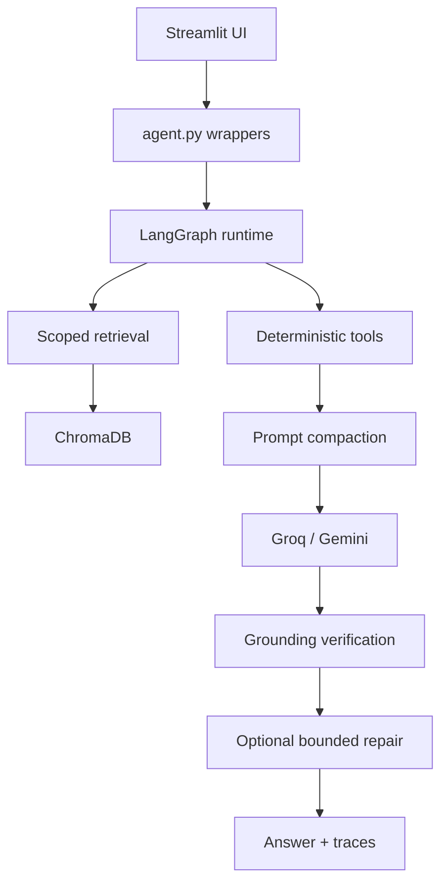
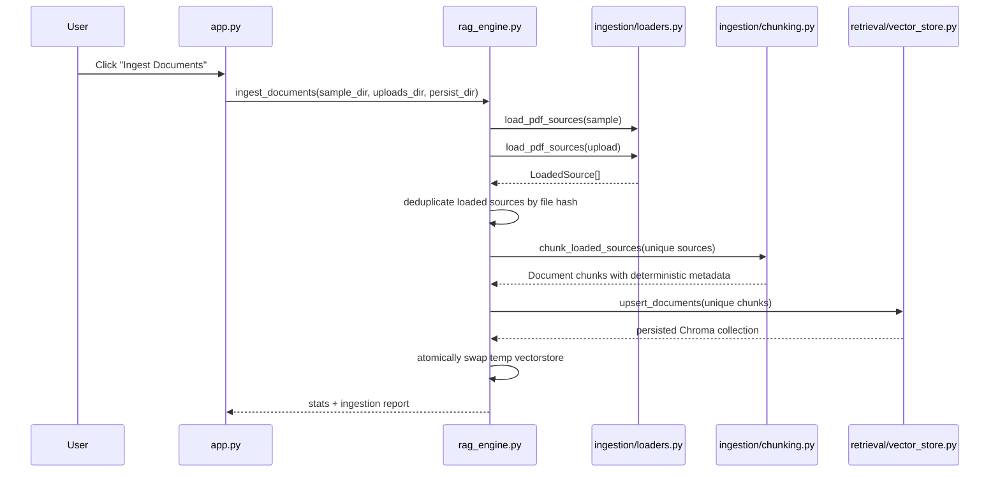
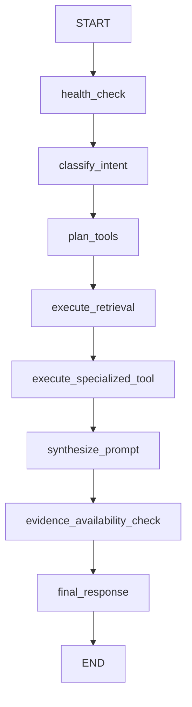
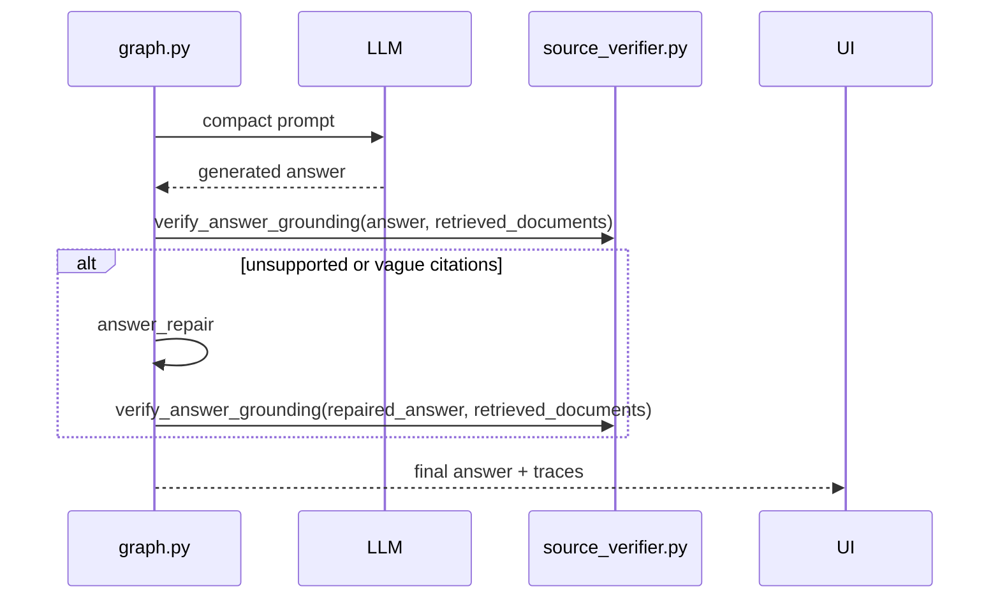

# Architecture

## Overview

Internal RFP Analyst has a narrow runtime surface:

- [app.py](../app.py) renders the Streamlit UI and owns session-state behavior.
- [agent.py](../agent.py) selects the provider, exposes UI-facing wrappers, and normalizes provider errors.
- [src/rfp_analyst/agent/graph.py](../src/rfp_analyst/agent/graph.py) is the canonical orchestration runtime.
- [rag_engine.py](../rag_engine.py) handles ingestion, vectorstore statistics, and retrieval.
- [src/rfp_analyst/tools](../src/rfp_analyst/tools) contains deterministic task-specific helpers.

## Component Architecture

### UI layer

The UI owns:

- upload persistence
- manual ingestion triggering
- document-scope selection
- evaluation snapshot rendering
- grouped source traces
- session-state safety around ingestion and pending uploads

### Adapter layer

[agent.py](../agent.py) is intentionally thin. It:

- resolves provider configuration
- constructs the LLM client
- converts canonical graph traces into UI-friendly reasoning traces
- formats known provider errors into safe user-facing messages

### Graph layer

The graph runtime is the source of truth for agentic behavior. It compiles a real `StateGraph` when `langgraph` is available and otherwise runs the same node functions in deterministic sequence.

## Ingestion Architecture

### File loading

[src/rfp_analyst/ingestion/loaders.py](../src/rfp_analyst/ingestion/loaders.py):

- sanitizes unsafe filenames
- validates file size and page count
- loads PDFs with `PyMuPDFLoader`
- enriches page documents with `source_file`, `source_path`, `file_hash`, `page`, `document_type`, and `document_origin`

### Chunking

[src/rfp_analyst/ingestion/chunking.py](../src/rfp_analyst/ingestion/chunking.py):

- splits documents with `RecursiveCharacterTextSplitter`
- computes deterministic `chunk_id` from origin, source namespace, file hash, page, chunk index, and content hash
- preserves metadata required for scoped retrieval and source validation

### Deduplication

`rag_engine.py` deduplicates:

- whole files by SHA256, preferring uploaded copies over sample copies
- chunks by `chunk_id` before Chroma upsert
- already-indexed chunks by existing Chroma IDs

### Atomic replacement and Windows safety

Ingestion builds a temporary vectorstore and swaps it into place. If Windows file locking blocks replacement, the app surfaces a friendly lock message rather than retrying automatically on rerun.

## Retrieval Architecture

[rag_engine.py](../rag_engine.py) and [src/rfp_analyst/retrieval/vector_store.py](../src/rfp_analyst/retrieval/vector_store.py) together provide:

- `VectorStoreManager.load`
- `VectorStoreManager.upsert_documents`
- `VectorStoreManager.get_retriever`
- `VectorStoreManager.similarity_search`
- `get_vectorstore_stats`
- `similarity_search`

Scoped retrieval uses `document_origin` filters:

- `sample`
- `upload`
- `all`

The graph can also inspect `indexed_sample_document_count`, `indexed_upload_document_count`, `indexed_*_files`, `pending_upload_files`, and `scope_chunk_counts`.

## LangGraph Execution Path

### State fields

The graph state includes:

- `user_query`
- `chat_history`
- `vectorstore_stats`
- `retrieval_k`
- `retrieval_scope`
- `retrieval_fn`
- `traces`
- `kb_ready`
- `intent`
- `planned_tools`
- `retrieved_documents`
- `retrieval_context`
- `specialized_notes`
- `tool_outputs`
- `prompt`
- `answer`
- `response_mode`
- `resolved_query`
- `resolved_entities`
- `grounded`
- `graph_backend`
- `prompt_budget`

### Node descriptions

- `health_check`: loads stats and determines whether the KB is actually ready.
- `classify_intent`: resolves conversational references and classifies the request.
- `plan_tools`: selects which deterministic tools will run.
- `execute_retrieval`: performs scoped search and target-context retrieval for `rfp_analysis`.
- `execute_specialized_tool`: runs comparison, requirements, case-study scoring, and proposal helpers.
- `synthesize_prompt`: compacts evidence and records prompt-budget trace data.
- `evidence_availability_check`: blocks LLM generation when there is no grounded evidence.
- `final_response`: final graph-side handoff before model generation.

## Graph Routing and Cross-Corpus Flow

### Intents

Implemented intents:

- `search`
- `compare`
- `proposal`
- `rfp_analysis`
- `previous_sources`
- `ambiguous`

### Cross-corpus RFP workflow

`rfp_analysis` has a distinct execution path:

1. derive a target-focused upload query
2. retrieve uploaded target evidence
3. extract requirements and inferred gaps from uploaded evidence
4. retrieve sample case-study evidence
5. score and rank case studies
6. compare fit
7. generate a six-section proposal outline
8. compact the prompt
9. generate and verify the final answer

Sample evidence is never treated as target requirements in this path.

## Prompt-Budget Architecture

Prompt compaction in [src/rfp_analyst/agent/graph.py](../src/rfp_analyst/agent/graph.py):

- excludes raw Python object serialization
- excludes `Document` object representations
- excludes nested retrieval results, `page_content` fields in tool outputs, and debug payloads
- limits uploaded target chunks, case-study count, case-study chunks, and history depth
- estimates token usage conservatively
- records a visible `prompt_budget` trace

When over budget, the runtime trims lower-value sample evidence and older history before touching required target evidence or the user’s current request.

## Grounding and Repair Flow

The repair pass is bounded to one attempt. Verification is heuristic rather than formal proof.

## Error Boundaries

The main error boundaries are:

- upload validation in [src/rfp_analyst/uploads.py](../src/rfp_analyst/uploads.py)
- ingestion exceptions in [rag_engine.py](../rag_engine.py)
- provider/configuration handling in [agent.py](../agent.py)
- retrieval and grounding fallbacks in [src/rfp_analyst/agent/graph.py](../src/rfp_analyst/agent/graph.py)
- UI-facing warning surfaces in [app.py](../app.py)
